# Blue Team Post-Attack Remediation – Detailed Guide

Step-by-step remediation procedures to secure the environment following the Red Team Phase 1 attack simulation. Follow the order: **Analysis → Remediation → Verification**.

> **Note:** All credentials, IP addresses and intentional weaknesses in this document are for an isolated lab environment only and must not be reused in production.

Images used by this document are stored under `./images/remediation/` in the repository.

---

## 1. Scenario 1: SSH Brute Force Remediation

**Target:** Linux Server (`10.10.0.51`)  
**Access:** SSH as `vbubuntu`  
**Goal:** Harden SSH configuration and enforce strong passwords to prevent brute force success.

### 1.1 Analyze Current State (Evidence)

Before applying fixes, confirm the vulnerability existence (weak password).

```bash
# Check current password hash (optional proof)
sudo grep webadmin /etc/shadow
```

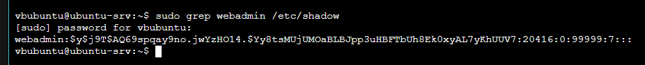
*Figure 1: Weak password hash visible before changes*

### 1.2 Remediation: Change Password

Replace the compromised weak password with a strong, complex passphrase.

```bash
sudo passwd webadmin
```

**New Credentials:**
- **User:** `webadmin`
- **Password:** `W3bAdm1nS3cure2025!`

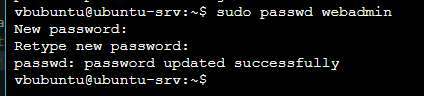
*Figure 2: Password updated successfully*

### 1.3 Remediation: Harden `sshd_config`

Edit the SSH daemon configuration to disable root login and limit authentication attempts.

```bash
sudo nano /etc/ssh/sshd_config
```

**Changes made:**
- `PermitRootLogin no`
- `MaxAuthTries 3`
- `PermitEmptyPasswords no`
- `LoginGraceTime 60`


*Figure 3: sshd_config modified with security best practices*

### 1.4 Apply and Verify

Restart the service to apply changes.

```bash
sudo systemctl restart ssh
sudo systemctl status ssh
```

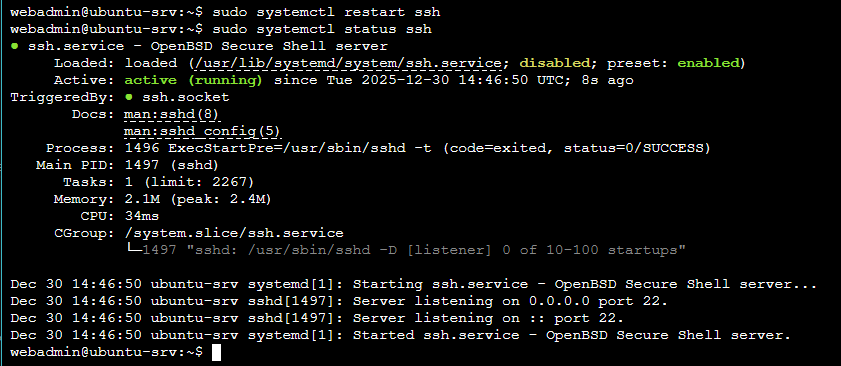
*Figure 4: SSH service active after configuration changes*

---

## 2. Scenario 3: Privilege Escalation Remediation

**Target:** Linux Server (`10.10.0.51`)  
**Access:** SSH as `vbubuntu`  
**Goal:** Remove insecure `sudo` configurations and clean up artifacts.

### 2.1 Analyze Vulnerability

Identify the `NOPASSWD` misconfiguration in sudoers.

```bash
sudo cat /etc/sudoers | grep -i nopasswd
```

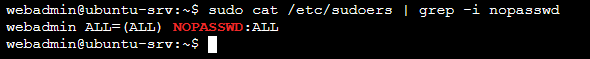
*Figure 5: NOPASSWD entry allows root access without authentication*

### 2.2 Remediation: Fix Sudoers

Use `visudo` to safely edit the configuration.

```bash
sudo visudo
```

**Action:**
- Locate: `webadmin ALL=(ALL) NOPASSWD: ALL`
- Change to: `webadmin ALL=(ALL) ALL` (or remove entirely)

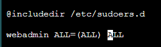
*Figure 6: Removing the NOPASSWD flag using visudo*

### 2.3 Verify Sudoers Fix

Confirm the entry is removed.

```bash
sudo cat /etc/sudoers | grep webadmin
```

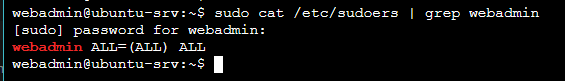
*Figure 7: NOPASSWD entry successfully removed*

### 2.4 Artifact Cleanup

Remove malicious files and checking cron jobs established by the attacker.

**(A) Check Cron Jobs:**
```bash
sudo ls -la /etc/cron.d/
sudo ls -la /var/spool/cron/crontabs/
```

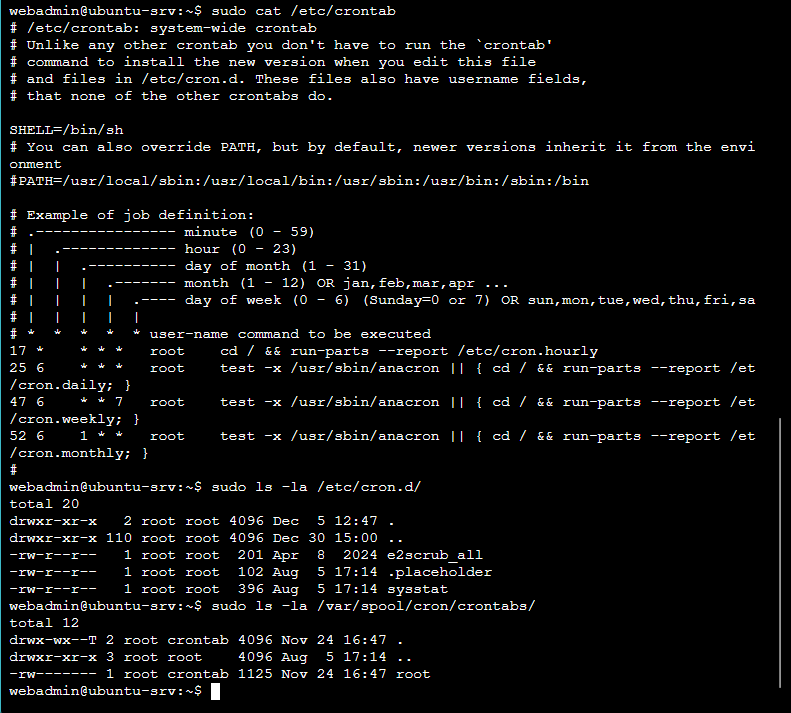
*Figure 8: Verifying cron directories are clean*

**(B) Remove Credentials File:**
```bash
sudo rm /tmp/db_config.py
ls -la /tmp/db_config.py
```

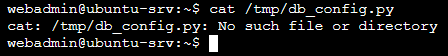
*Figure 9: Hardcoded credentials file deleted*

---

## 3. Scenario 2: C2 Exfiltration Remediation

**Target:** pfSense Firewall (`10.10.0.1`)  
**Access:** Web GUI via Windows Workstation  
**Goal:** Implement network segmentation to block communication with the C2 server (`10.10.0.53`).

### 3.1 Access Firewall

Login to the pfSense dashboard.

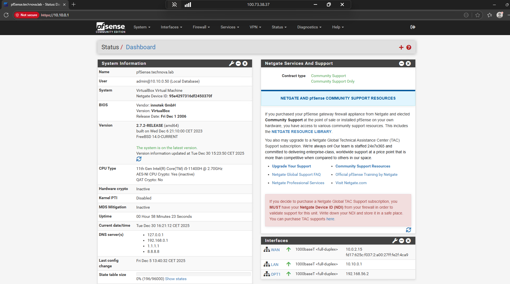
*Figure 10: Successful login to pfSense administration*

### 3.2 Create Block Rule

**Navigation:** Firewall → Rules → LAN

**Action:** Add a new rule at the **TOP** of the list.

| Setting | Value |
|---------|-------|
| **Action** | Block |
| **Protocol** | TCP |
| **Source** | 10.10.0.50 (Windows Workstation) |
| **Destination** | 10.10.0.53 (C2 Server) |
| **Dst Port** | 8888 |
| **Log** | Enabled |

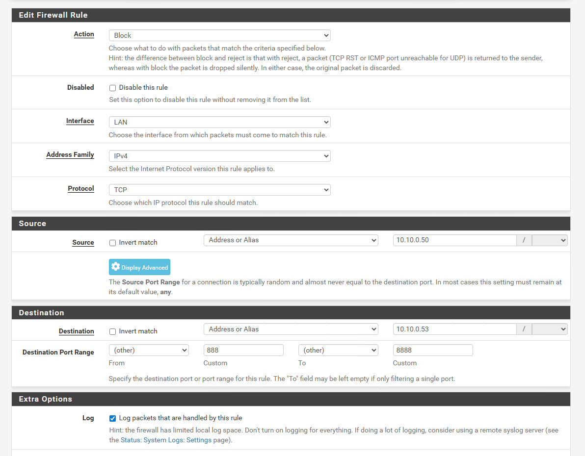
*Figure 11: Configuring the block rule for port 8888*

### 3.3 Verify Rule Placement

Ensure the block rule is above the "Default Allow LAN to any" rule.

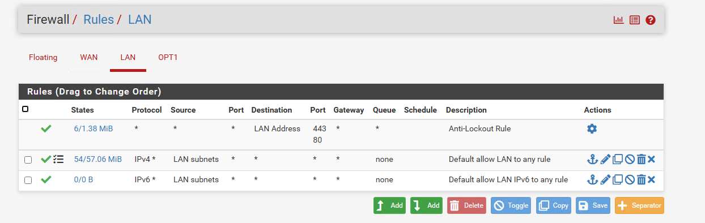
*Figure 12: Rule list structure (ensure Block is at the top)*

### 3.4 Apply Changes

Commit the new configuration.

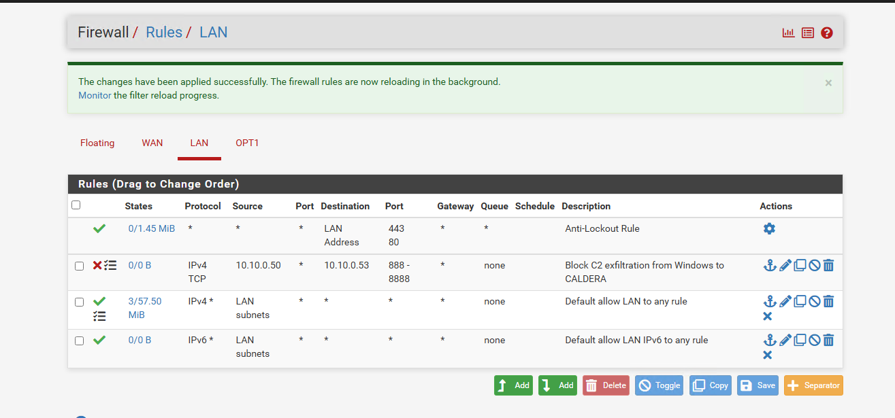
*Figure 13: Changes applied successfully*

---

## 4. Scenario 4: Lateral Movement Remediation

**Target:** Windows Workstation (`10.10.0.50`)  
**Access:** RDP as `TECHNOVA\blue_team` (Admin)  
**Goal:** Enable host-based firewall and block specific lateral movement techniques.

### 4.1 Analyze Current State

Check the current firewall profile status (expected: False/Disabled).

```powershell
Get-NetFirewallProfile | Select-Object Name, Enabled
```

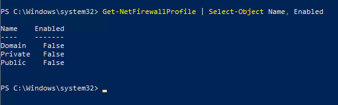
*Figure 14: Windows Firewall disabled on all profiles*

### 4.2 Remediation: Enable Firewall

Activate the firewall for all profiles (Domain, Public, Private).

```powershell
Set-NetFirewallProfile -Profile Domain,Public,Private -Enabled True
```

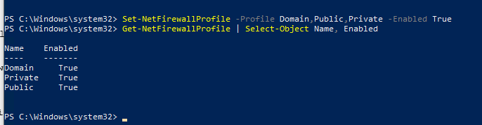
*Figure 15: Firewall profiles successfully enabled*

### 4.3 Remediation: Block Attacker IPs (Hardening)

Create explicit inbound block rules for the Attacker (Caldera) and Compromised Server (Linux).

```powershell
# Block Caldera (C2)
New-NetFirewallRule -DisplayName "Block CALDERA Attacker Inbound" -Direction Inbound -RemoteAddress 10.10.0.53 -Action Block

# Block SMB/RPC from Compromised Linux Server
New-NetFirewallRule -DisplayName "Block SMB from Ubuntu Server" -Direction Inbound -LocalPort 445 -RemoteAddress 10.10.0.51 -Action Block
New-NetFirewallRule -DisplayName "Block RPC from Ubuntu Server" -Direction Inbound -LocalPort 135 -RemoteAddress 10.10.0.51 -Action Block
New-NetFirewallRule -DisplayName "Block WMI from External" -Direction Inbound -LocalPort 5985,5986 -RemoteAddress 10.10.0.51,10.10.0.53 -Action Block
```

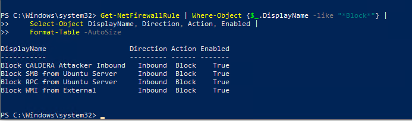
*Figure 16: PowerShell confirmation of created block rules*

### 4.4 Verify via GUI

Visually confirm the rules in "Windows Defender Firewall with Advanced Security".

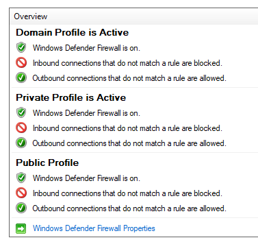
*Figure 17: Firewall GUI showing enabled state*

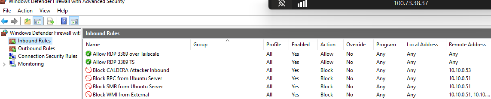
*Figure 18: Inbound rules list showing active blocks*

### 4.5 Cleanup Malware

Remove the artifacts left by the attacker.

```powershell
Remove-Item "C:\Users\Public\splunkd.exe" -Force
Get-ChildItem "C:\Users\Public\*.exe"
```

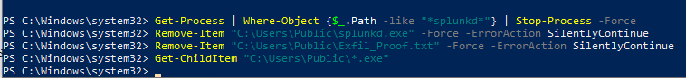
*Figure 19: Verification that malicious executable is removed*

---

## 5. Additional Linux Server Cleanup

**Target:** Linux Server (`10.10.0.51`)  
**Access:** SSH as `vbubuntu`  
**Goal:** Remove attack tools and C2 agent left by Red Team.

### 5.1 Remove Impacket Attack Tools

The Red Team staged Impacket tools on the Linux server for lateral movement. These must be removed.

```bash
# Remove attack scripts
rm -f /home/vbubuntu/psexec.py
rm -f /home/vbubuntu/wmiexec.py
rm -f /home/vbubuntu/smbclient.py

# Verify removal
ls -la /home/vbubuntu/*.py
```

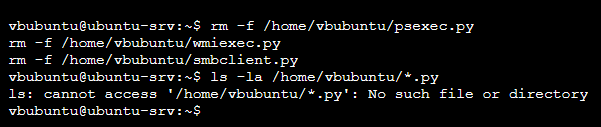
*Figure 20: Impacket attack tools successfully removed*

### 5.2 Kill and Remove CALDERA Agent

The CALDERA agent (`splunkd`) was running on the Linux server, maintaining connection to C2.

```bash
# Kill the agent process
pkill -f splunkd
ps aux | grep splunkd

# Remove agent binaries
rm -f /home/vbubuntu/splunkd
rm -f /home/vbubuntu/splinkd

# Verify removal
ls -la /home/vbubuntu/splunk*
```

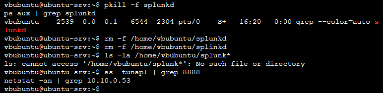
*Figure 21: CALDERA agent killed and removed*

### 5.3 Verify No Active C2 Connections

Confirm there are no remaining connections to the C2 server.

```bash
ss -tunapl | grep 8888
netstat -an | grep 10.10.0.53
```

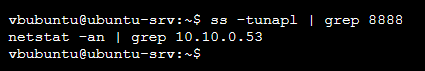
*Figure 22: No active connections to C2 server confirmed*

---

## 6. Post-Remediation Verification Summary

| Scenario | Vulnerability | Fix | Verification Status |
|----------|---------------|-----|---------------------|
| **1. SSH** | Weak Password | Password Changed + Hardened Config | ✅ Verified |
| **2. PrivEsc** | NOPASSWD Sudo | Entry Removed | ✅ Verified |
| **3. C2** | Open Outbound | pfSense Block Rule (Port 8888) | ✅ Verified |
| **4. Lateral** | Firewall Disabled | Firewall Enabled + Block Rules | ✅ Verified |
| **5. Cleanup** | Attack Tools & C2 Agent | Impacket + splunkd Removed | ✅ Verified |

The environment is now secured against the techniques used in the Phase 1 simulation.

---

## 7. Credential Change

> **Credential Rotation Performed**
> 
> During the Red Team attack, the `admin_lab` domain account credentials were extracted from `/tmp/db_config.py`:
> ```
> db_user = 'admin_lab'
> db_pass = 'Administrator1209!!'
> ```
> 
> These credentials were successfully used for lateral movement via PsExec. **The password has been changed** to prevent future misuse of the compromised credentials.

> **Remediation performed on Domain Controller:**
> ```powershell
> Set-ADAccountPassword -Identity "admin_lab" -NewPassword (ConvertTo-SecureString "Adm1nL4bS3cure2025!" -AsPlainText -Force) -Reset
> ```
> 
> **New Credentials:**
> - **User:** `admin_lab`
> - **Password:** `Adm1nL4bS3cure2025!`
> 
> The Infrastructure Engineer credentials document has been updated accordingly.
> See: [00-credentials-and-access.md](../infrastructure-engineer/00-credentials-and-access.md)
