# Blue Team Pre-Attack Setup – Detailed Guide

End-to-end checklist to prepare monitoring before the Red Team starts. Follow the order: gain visibility, confirm intentional weaknesses, and prove telemetry works.

> Note: All credentials, IP addresses and intentional weaknesses in this document are for an isolated lab environment only and must not be reused in production.

Images used by this document are stored under `./images/pre-attack/` in the repository.

---

## 0. Prerequisites – Agents Already Installed

Confirm both agents are installed and reporting before deeper configuration.

### 0.1 Windows agent (Workstation `10.10.0.50`)

```powershell
Get-Service WazuhSvc
```

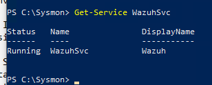
*Figure 1: Wazuh service installed on the workstation*

### 0.2 Linux agent (Server `10.10.0.51`)

```bash
systemctl status wazuh-agent
```

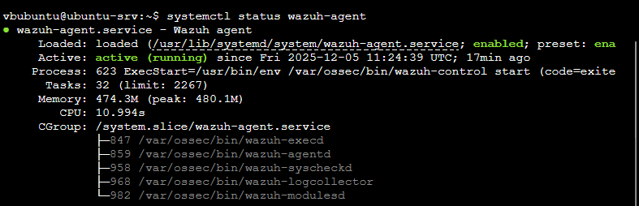
*Figure 2: Linux Wazuh agent active*

### 0.3 Verify from Wazuh server (`10.10.0.70`)

```bash
sudo /var/ossec/bin/agent_control -l
```

---

## 1. Wazuh Server Hardening (Central SIEM)

**Location:** `10.10.0.70` via SSH as `vbwazuh` (Password: `Wazuh!$1`)  
**Goal:** Add custom detections, accept pfSense syslog, and verify health.

### 1.1 Connect

```bash
ssh vbwazuh@10.10.0.70
```

### 1.2 Load custom detection rules

```bash
sudo nano /var/ossec/etc/rules/local_rules.xml
```

Rules that were added:

```xml
<!-- TechNova Custom Detection Rules -->
<group name="technova,custom,">

  <!-- SSH brute force -->
  <rule id="100001" level="10" frequency="5" timeframe="60">
    <if_matched_sid>5710</if_matched_sid>
    <description>SSH brute force attack detected (5+ failed attempts in 60s)</description>
    <mitre><id>T1110</id></mitre>
    <group>authentication_failures,</group>
  </rule>

  <rule id="100002" level="12">
    <if_sid>5715</if_sid>
    <description>SSH login success after multiple failed attempts - possible brute force success</description>
    <mitre><id>T1110</id></mitre>
    <group>authentication_success,</group>
  </rule>

  <!-- Sudo abuse -->
  <rule id="100011" level="10">
    <if_sid>5402</if_sid>
    <match>NOPASSWD</match>
    <description>Sudo command executed without password (NOPASSWD misconfiguration)</description>
    <mitre><id>T1548.003</id></mitre>
    <group>privilege_escalation,</group>
  </rule>

  <rule id="100012" level="12">
    <if_sid>5402</if_sid>
    <match>/etc/shadow|/etc/passwd|/etc/sudoers</match>
    <description>Sudo used to access sensitive system files</description>
    <mitre><id>T1003</id></mitre>
    <group>privilege_escalation,credential_access,</group>
  </rule>

  <!-- PowerShell attacks -->
  <rule id="100020" level="10">
    <if_sid>61603</if_sid>
    <field name="win.eventdata.image">powershell.exe|pwsh.exe</field>
    <description>PowerShell process execution detected</description>
    <mitre><id>T1059.001</id></mitre>
    <group>powershell,execution,</group>
  </rule>

  <rule id="100021" level="12">
    <if_sid>61605</if_sid>
    <field name="win.eventdata.image">powershell.exe|pwsh.exe</field>
    <description>PowerShell making network connection - possible C2 communication</description>
    <mitre><id>T1071</id></mitre>
    <group>powershell,command_and_control,</group>
  </rule>

  <rule id="100022" level="14">
    <if_sid>61603</if_sid>
    <field name="win.eventdata.commandLine">-enc|-EncodedCommand|FromBase64String</field>
    <description>PowerShell encoded command detected - possible obfuscation</description>
    <mitre><id>T1027</id></mitre>
    <group>powershell,defense_evasion,</group>
  </rule>

  <rule id="100023" level="12">
    <if_sid>61603</if_sid>
    <field name="win.eventdata.commandLine">Invoke-WebRequest|wget|curl|Net.WebClient</field>
    <description>PowerShell web request detected - possible data exfiltration</description>
    <mitre><id>T1041</id></mitre>
    <group>powershell,exfiltration,</group>
  </rule>

  <!-- File integrity monitoring -->
  <rule id="100040" level="12">
    <if_sid>550</if_sid>
    <match>/etc/sudoers|/etc/shadow|/etc/passwd|/etc/crontab</match>
    <description>Critical system file modified - integrity check failed</description>
    <mitre><id>T1222</id></mitre>
    <group>file_integrity,</group>
  </rule>

  <rule id="100041" level="10">
    <if_sid>550</if_sid>
    <match>/etc/cron|/var/spool/cron</match>
    <description>Cron job configuration modified - possible persistence</description>
    <mitre><id>T1053.003</id></mitre>
    <group>file_integrity,persistence,</group>
  </rule>

  <!-- Lateral movement -->
  <rule id="100050" level="10" frequency="5" timeframe="120">
    <if_matched_sid>60122</if_matched_sid>
    <description>Multiple RDP login failures - possible lateral movement attempt</description>
    <mitre><id>T1021.001</id></mitre>
    <group>lateral_movement,</group>
  </rule>

  <rule id="100051" level="8">
    <if_sid>60103</if_sid>
    <description>Possible port scan detected from internal network</description>
    <mitre><id>T1046</id></mitre>
    <group>reconnaissance,</group>
  </rule>

  <!-- pfSense firewall events -->
  <rule id="100060" level="5">
    <decoded_as>pfsense</decoded_as>
    <match>block</match>
    <description>pfSense firewall blocked traffic</description>
    <group>firewall,</group>
  </rule>

  <rule id="100061" level="8">
    <if_sid>100060</if_sid>
    <srcip>10.10.0.50</srcip>
    <description>Blocked outbound traffic from Windows workstation - containment active</description>
    <group>firewall,containment,</group>
  </rule>

</group>
```

### 1.3 Add pfSense decoder

```bash
sudo nano /var/ossec/etc/decoders/local_decoder.xml
```

Decoder that was added:

```xml
<!-- pfSense Firewall Log Decoder -->
<decoder name="pfsense">
  <program_name>filterlog</program_name>
</decoder>

<decoder name="pfsense-fields">
  <parent>pfsense</parent>
  <regex offset="after_parent">(\d+),(\S+),(\S+),(\S+),(\S+),(\S+),(\S+),(\S+),(\S+),(\S+),(\S+),(\S+),(\S+),(\S+),(\S+),(\S+),(\S+),(\S+),(\S+),(\S+)</regex>
  <order>rule_number,sub_rule,anchor,tracker,interface,reason,action,direction,ip_version,tos,ecn,ttl,id,offset,flags,protocol_id,protocol,length,srcip,dstip</order>
</decoder>
```

### 1.4 Accept syslog from pfSense

```bash
sudo nano /var/ossec/etc/ossec.conf
```

Add inside `<ossec_config>`:

```xml
<remote>
  <connection>syslog</connection>
  <port>514</port>
  <protocol>udp</protocol>
  <allowed-ips>10.10.0.1</allowed-ips>
</remote>
```

### 1.5 Restart and validate

```bash
sudo systemctl restart wazuh-manager
sudo /var/ossec/bin/wazuh-control status
```

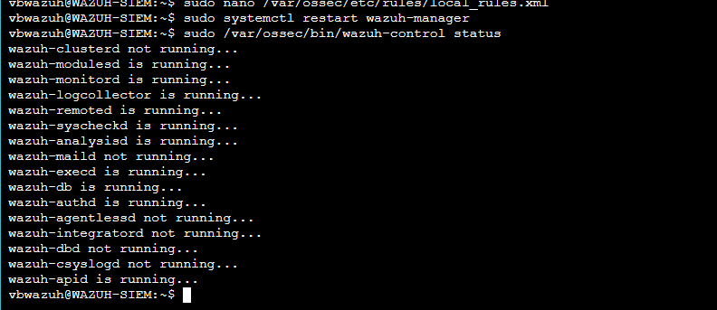
*Figure 4: All Wazuh daemons running*

Health checks:

```bash
ls -la /var/ossec/etc/rules/local_rules.xml
ls -la /var/ossec/etc/decoders/local_decoder.xml
sudo tail -5 /var/ossec/logs/ossec.log | grep -i error
sudo ss -ulnp | grep 514
```

### 1.6 Confirm agents reporting
Re-run `sudo /var/ossec/bin/agent_control -l` and ensure both agents remain **Active** (see step 0.3 for reference output).

---

## 2. Windows Workstation (`10.10.0.50`)

**Access:** RDP as `TECHNOVA\blue_team` (Password: `BlueTeam0987!!`)  
**Goal:** Enable deep visibility (Sysmon + event channels), keep firewall intentionally disabled.

### 2.1 Install Sysmon

```powershell
Invoke-WebRequest -Uri "https://download.sysinternals.com/files/Sysmon.zip" -OutFile "C:\sysmon.zip"
Expand-Archive C:\sysmon.zip -DestinationPath C:\Sysmon
Invoke-WebRequest -Uri "https://raw.githubusercontent.com/SwiftOnSecurity/sysmon-config/master/sysmonconfig-export.xml" -OutFile "C:\Sysmon\config.xml"
cd C:\Sysmon
\.\Sysmon64.exe -i config.xml -accepteula -h md5,sha256,imphash -l -n
```

### 2.2 Verify Sysmon

```powershell
Get-Service Sysmon64
```

### 2.3 Confirm logs arrive

```powershell
Get-WinEvent -LogName "Microsoft-Windows-Sysmon/Operational" -MaxEvents 3 | Format-List TimeCreated, Id, Message
```

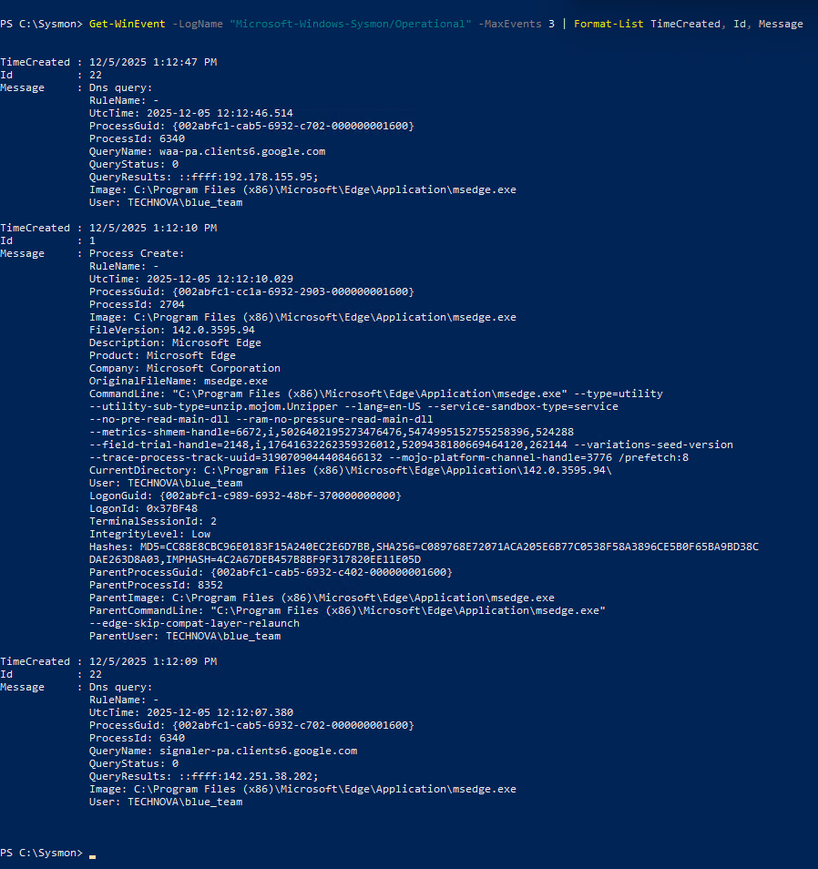
*Figure 9: Recent Sysmon operational events*

### 2.4 Extend Wazuh collection

Edit `C:\Program Files (x86)\ossec-agent\ossec.conf` and add:

```xml
<localfile>
  <location>Microsoft-Windows-Sysmon/Operational</location>
  <log_format>eventchannel</log_format>
</localfile>
<localfile>
  <location>Microsoft-Windows-PowerShell/Operational</location>
  <log_format>eventchannel</log_format>
</localfile>
<localfile>
  <location>Security</location>
  <log_format>eventchannel</log_format>
</localfile>
<syscheck>
  <windows_registry>HKEY_LOCAL_MACHINE\Software\Microsoft\Windows\CurrentVersion\Run</windows_registry>
  <windows_registry>HKEY_LOCAL_MACHINE\Software\Microsoft\Windows\CurrentVersion\RunOnce</windows_registry>
</syscheck>
```

### 2.5 Restart and verify agent

```powershell
Restart-Service WazuhSvc
Get-Service WazuhSvc
```

### 2.6 Disable firewall (intentional vulnerability)

```powershell
Set-NetFirewallProfile -Profile Domain,Public,Private -Enabled False
Get-NetFirewallProfile | Select-Object Name, Enabled
```


*Figure 10: Domain/Public/Private all disabled (planned weakness)*

### 2.7 Quick verification (summary)

Confirm:
- `Sysmon64` service is **Running**
- `WazuhSvc` service is **Running**
- Domain/Private/Public firewalls are **Disabled**

---

## 3. Linux Server (`10.10.0.51`)

**Access:** SSH as `vbubuntu`  
**Goal:** Enable FIM coverage and keep deliberate weaknesses for scenarios.

### 3.1 Configure FIM scope

```bash
sudo nano /var/ossec/etc/ossec.conf
```

Add within `<syscheck>`:

```xml
<syscheck>
  <disabled>no</disabled>
  <frequency>300</frequency>
  <scan_on_start>yes</scan_on_start>
  <directories check_all="yes" realtime="yes" report_changes="yes">/etc/sudoers</directories>
  <directories check_all="yes" realtime="yes" report_changes="yes">/etc/shadow</directories>
  <directories check_all="yes" realtime="yes" report_changes="yes">/etc/passwd</directories>
  <directories check_all="yes" realtime="yes" report_changes="yes">/etc/crontab</directories>
  <directories check_all="yes" realtime="yes" report_changes="yes">/etc/cron.d</directories>
  <directories check_all="yes" realtime="yes" report_changes="yes">/var/spool/cron</directories>
  <directories check_all="yes" realtime="yes" report_changes="yes">/etc/ssh/sshd_config</directories>
  <directories check_all="yes" realtime="yes" report_changes="yes">/usr/local/bin/backup.sh</directories>
</syscheck>
```

### 3.2 Restart and verify agent

```bash
sudo systemctl restart wazuh-agent
systemctl status wazuh-agent
```

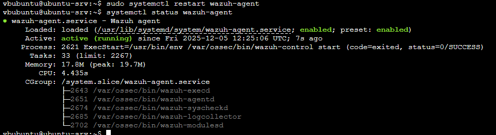
*Figure 12: wazuh-agent active after restart*

### 3.3 Confirm intentional weaknesses

```bash
id webadmin
sudo cat /etc/sudoers | grep webadmin
```


*Figure 13: NOPASSWD still present (kept for Scenario 3)*

Test the weak password (do not change yet):

```bash
su - webadmin
```

### 3.4 Quick verification (summary)

Confirm:
- `wazuh-agent` is **active**
- FIM entries with `realtime="yes"` are present in `/var/ossec/etc/ossec.conf`
- `webadmin` user exists and still has a `NOPASSWD` sudo entry

---

## 4. pfSense Firewall (`https://10.10.0.1`) on Windows Workstation

**Goal:** Forward firewall logs to Wazuh and confirm receipt.

### 4.1 Enable LAN rule logging

GUI: **Firewall → Rules → LAN** → edit default allow rule → **Log packets** → Save → Apply.

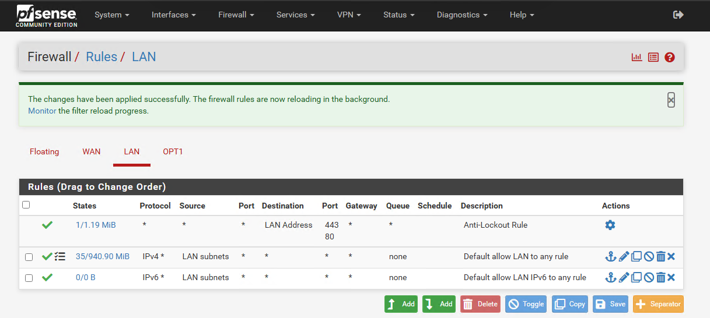
*Figure 15: LAN rule logging enabled for visibility*

### 4.2 Send logs to Wazuh

GUI: **Status → System Logs → Settings → Remote Logging Options**
- Enable Remote Logging
- Remote log servers: `10.10.0.70:514`
- Check **Firewall Events**
- Save


*Figure 16: pfSense shipping logs to Wazuh over UDP 514*

### 4.3 Confirm syslog packets reach Wazuh

```bash
sudo tcpdump -i any port 514 -c 10
```

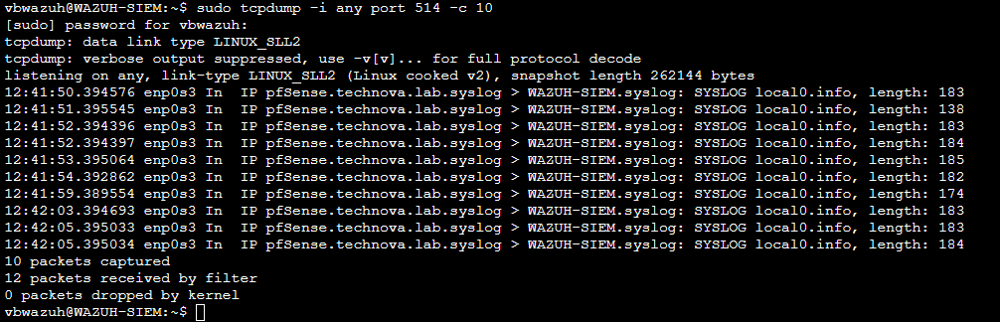
*Figure 17: UDP 514 packets arriving from 10.10.0.1*

If nothing appears, re-check GUI settings and generate LAN traffic.

---

## 5. Final Verification & Signal Tests

Run before handing control to Red Team.

### 5.1 Agent heartbeat

```bash
sudo /var/ossec/bin/agent_control -l
```

### 5.2 Windows telemetry test (Sysmon → Wazuh)

Generate an event:

```powershell
cmd.exe /c "echo test"
```

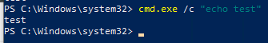
*Figure 19: Sysmon Event ID 1 created*

Check Wazuh alerts:

```bash
sudo tail -20 /var/ossec/logs/alerts/alerts.log | grep -i sysmon
```

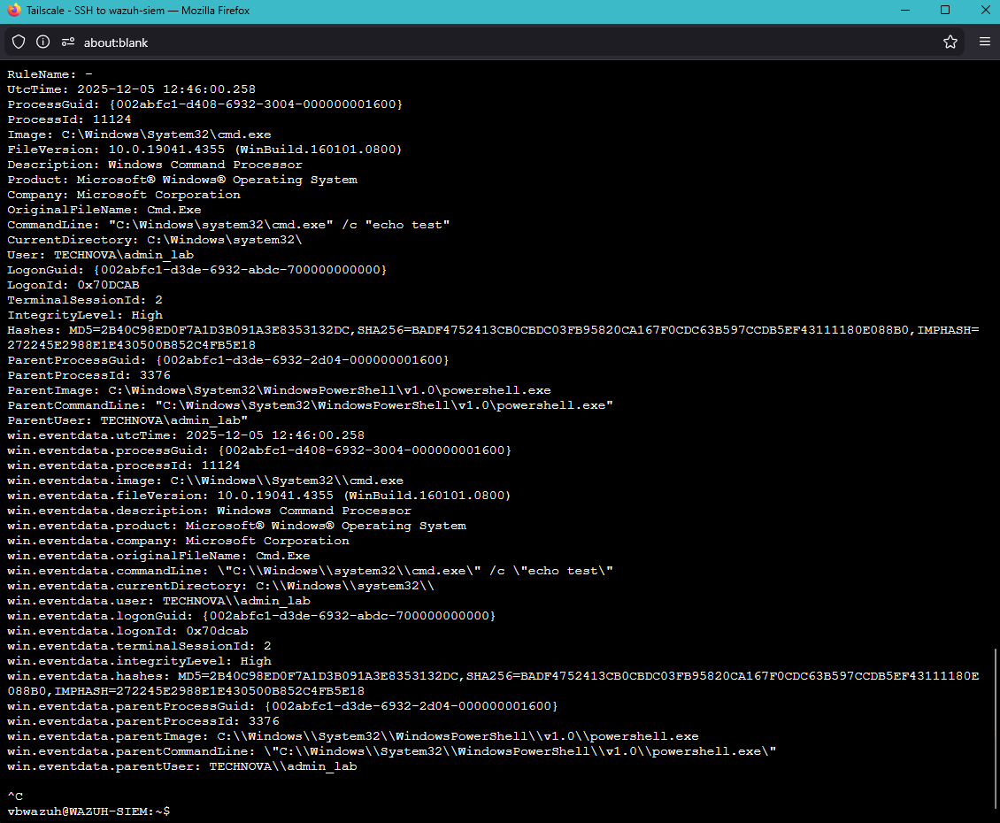
*Figure 20: Sysmon event ingested by Wazuh*

### 5.3 Linux FIM test (File touch/remove → Wazuh)

```bash
sudo touch /etc/cron.d/test_fim
sudo rm /etc/cron.d/test_fim
```

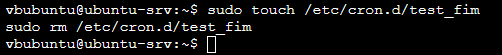
*Figure 21: FIM test commands executed*

Verify alert:

```bash
sudo tail -20 /var/ossec/logs/alerts/alerts.log | grep cron.d
```

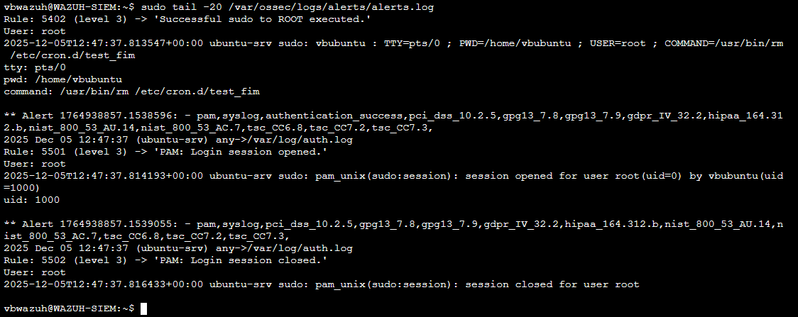
*Figure 22: FIM change detected in Wazuh*

---

## Pre-Attack Status Snapshot

| Component | IP | Status | Intentional Vulnerability |
|-----------|----|--------|---------------------------|
| Wazuh SIEM | 10.10.0.70 | Monitoring active | None |
| Windows Workstation | 10.10.0.50 | Agent + Sysmon running | Firewall disabled |
| Linux Server | 10.10.0.51 | Agent + FIM running | Weak password + NOPASSWD |
| pfSense | 10.10.0.1 | Logging to Wazuh | None |
| CALDERA | 10.10.0.60 | Ready (attacker role) | N/A |

---

## Ready for Red Team

Keep a live view during the exercise:

```bash
sudo tail -f /var/ossec/logs/alerts/alerts.log | grep -E "level.*[0-9]+"
```