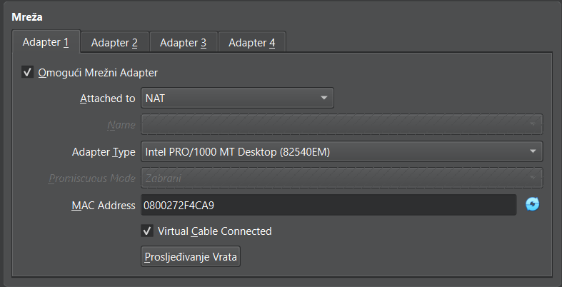
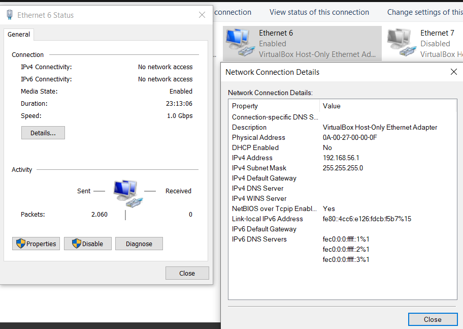
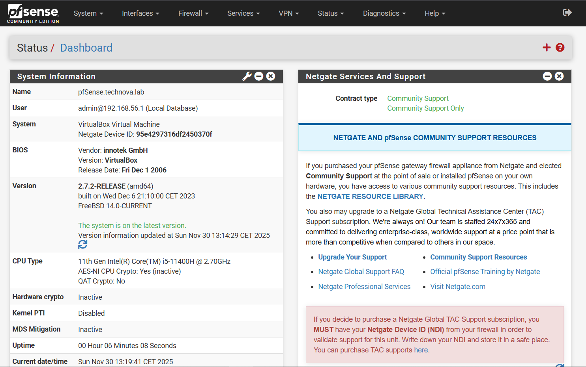
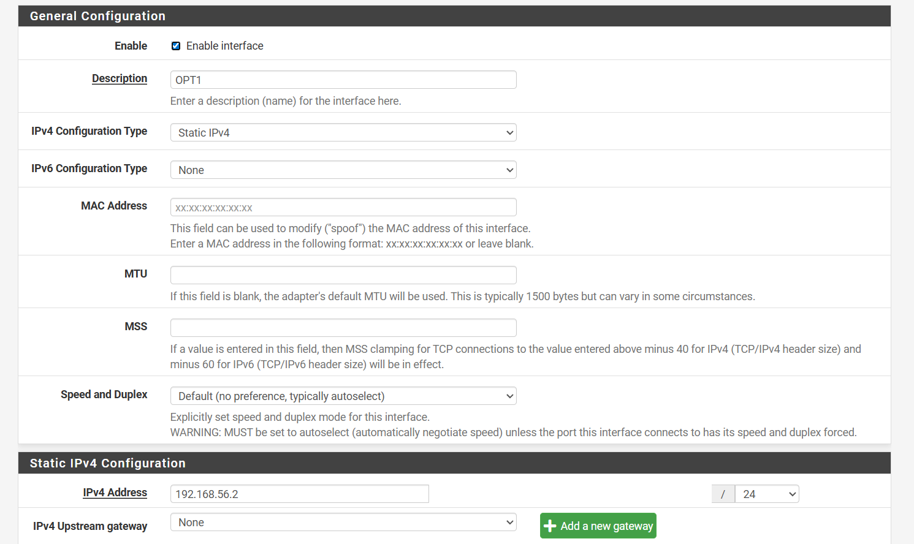
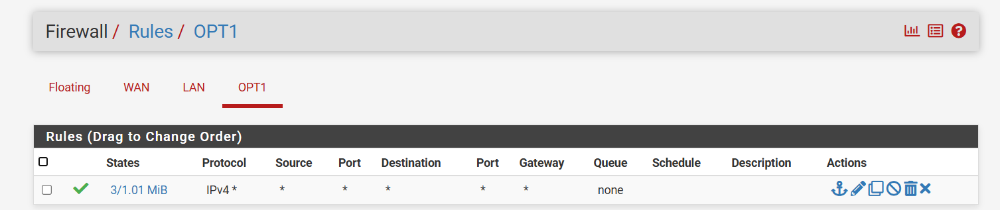
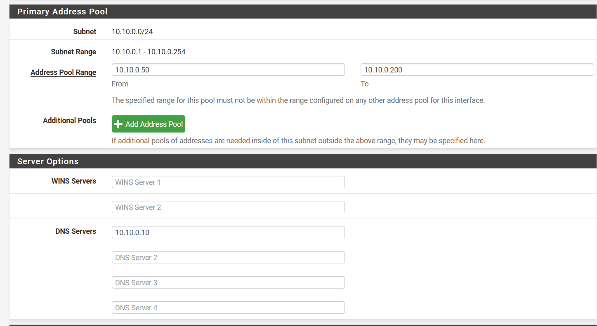
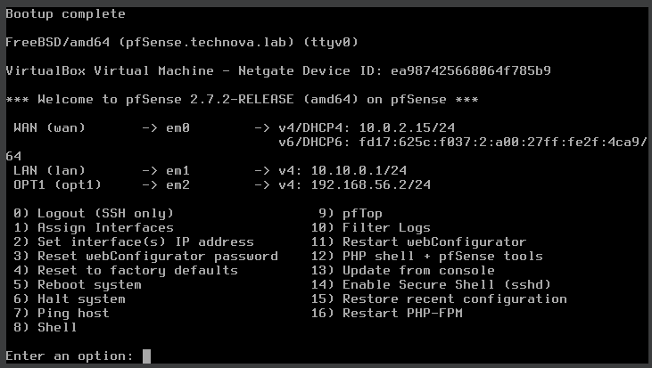

# pfSense Setup – Detailed Troubleshooting & Configuration Guide

This document summarizes the complete process of installing, configuring, and troubleshooting pfSense inside VirtualBox for a multi-team cyber-range project (MITRE CALDERA). It includes:
- Detailed steps performed
- Why each step was required
- Problems encountered
- Root cause analysis
- Final solutions
- Verified final configuration

## Table of Contents
- [Creating the pfSense Virtual Machine in VirtualBox](#1-creating-the-pfsense-virtual-machine-in-virtualbox)
- [pfSense Installation Summary](#2-pfsense-installation-summary)
- [Host-Only Network Configuration (OPT1)](#3-host-only-network-configuration-opt1)
- [Major Problem – Cannot Ping 192.168.56.2 (OPT1)](#4-major-problem--cannot-ping-19216856-2-opt1)
- [Solutions Applied](#5-solutions-applied)
- [Successful Outcome – OPT1 Working](#6-successful-outcome--opt1-working)
- [Final Verified Network Architecture](#7-final-verified-network-architecture)
- [Final Verified State](#8-final-verified-state)
- [pfSense Configuration in the Web GUI (Step-by-Step)](#9-pfsense-configuration-in-the-web-gui-step-by-step)

---

## 1. Creating the pfSense Virtual Machine in VirtualBox

 Prepared a pfSense VM with three network adapters:




*Figure 1: VirtualBox network adapter configuration for pfSense VM*

### Adapter 1 – NAT (WAN)
Used to provide pfSense with internet access via VirtualBox NAT.
- WAN IP obtained: `10.0.2.x` (DHCP)
- Required for package updates and general connectivity.

### Adapter 2 – Internal Network (LAN / TechNovaNet)
This is your isolated lab network.
- LAN IP configured as: `10.10.0.1/24`
- Used by: Windows Server (Domain Controller), Workstations, Linux CALDERA VM, etc.
- **Windows host is NOT part of this network** 

### Adapter 3 – Host-Only Network (Management / Admin Network)
This allows only YOU (Windows host) to reach pfSense.
- Host-only adapter IP (Windows): `192.168.56.1`
- pfSense OPT1 IP: `192.168.56.2/24`
- Purpose: Secure admin access to pfSense GUI.

**Reasoning:**
- LAN is reserved only for virtual lab machines.
- You must not manage pfSense from LAN (security best practice).
- Host-only interface provides a separate admin channel.

---

## 2. pfSense Installation Summary

- Selected **GPT(GUID Partition Table)** → correct for VM environments.
- Used **Auto-UFS** partitioning.
- Allowed pfSense to auto-detect WAN/LAN.

**Initial problem:**
- Tried accessing pfSense via `https://10.10.0.1` → did not work.
- **Reason:** Windows host is not in the LAN network.

---

## 3. Host-Only Network Configuration (OPT1)

VirtualBox created:
- **VirtualBox Host-Only Ethernet Adapter** → `192.168.56.1/24`

 Configured:
- pfSense OPT1 IP = `192.168.56.2/24`



*Figure 2: Windows host-only network adapter manual configuration*

**Reason:**
- Creates an isolated, secure admin network between pfSense and Windows host.
- Required for GUI access.

---

## 4. Major Problem – Cannot Ping 192.168.56.2 (OPT1)

### Symptoms:
- Request timed out
- Destination host unreachable

### Root Causes Identified:

1. **VirtualBox Host-Only DHCP was enabled** → ARP/gateway conflicts.
2. **Windows Firewall blocked outbound ICMP** on unidentified networks.
3. **VirtualBox created hidden duplicate host-only adapters** (#2, #3) causing routing mismatch.
4. **pfSense OPT1 had no firewall rule** (default = block all).

All four combined made OPT1 unreachable.

---

## 5. Solutions Applied

### 5.1 Disabled VirtualBox DHCP on the host-only adapter
Required to prevent ARP conflicts.

### 5.2 Manually assigned Windows host-only NIC:
```
IP: 192.168.56.1
Mask: 255.255.255.0
Gateway: (empty)
DNS: (empty)
```

### 5.3 Reconfigured pfSense OPT1
```
IP: 192.168.56.2
Mask: /24
```

Added firewall rule:
```
Action: Pass
Interface: OPT1
Protocol: Any
Source: Any
Destination: Any
```

### 5.4 Reset pfSense Admin Password
Used console option:
```
3) Reset webConfigurator password
```

### 5.5 Temporarily disabled pfSense firewall for testing
```bash
pfctl -d
```
Used ONLY to confirm connectivity.

### 5.6 Corrected Host-Only Adapter Selection
Removed duplicate adapters and ensured pfSense Adapter 3 used the correct one.

---

## 6. Successful Outcome – OPT1 Working

The following now works:
-  Ping `192.168.56.2` from Windows
-  pfSense GUI at `https://192.168.56.2`
-  Setup Wizard completed
-  WAN functional: `10.0.2.15`
-  LAN functional: `10.10.0.1`
-  OPT1 firewall rule present

This means pfSense is fully configured and stable.

---

## 7. Final Verified Network Architecture

```
                (VirtualBox NAT)
                     WAN
                 10.0.2.x/24
                      │
                [ pfSense ]
                      │
        ┌─────────────┴──────────────┐
        │                            │
   LAN Network                 OPT1 Admin Network
 10.10.0.0/24                  192.168.56.0/24
(Internal Network)                (Host-Only)
        │                            │
  Windows Server             Windows Host (you)
  Workstations
  Linux CALDERA
  Kali Linux
```

---
## 8. Final Verified State

 pfSense deployment is now:
- Fully functional
- Stable
- Securely accessible via OPT1
- Ready for internal LAN machines
- Ready for MITRE CALDERA simulation
- Ready for team members to connect to the environment via VPN (ZeroTier recommended)

This completes the pfSense infrastructure layer.

---

## 9. pfSense Configuration in the Web GUI (Step-by-Step)

This section describes what was specifically configured in the pfSense web interface and why.

### 9.1. First Access to pfSense GUI

1. Opened in browser:
   - `https://192.168.56.2`
2. Accepted certificate warning (self-signed certificate).
3. Logged in with:
   - Username: `admin`
   - Password: `pfsense` (after resetting via console).



*Figure 3: pfSense web interface dashboard showing WAN, LAN, and OPT1 status*

**Reason:**
- This is the admin interface for complete firewall, network, DHCP, DNS, and other configurations.

---

### 9.2. Setup Wizard

Steps in Setup Wizard (System → Setup Wizard):

#### 1. General Information
- Hostname: `pfsense`
- Domain: `technova.lab`

#### 2. DNS Server Settings
- Primary DNS: `1.1.1.1`
- Secondary DNS: `8.8.8.8`
- Disabled option that overrides DNS servers from WAN (to use these fixed DNS servers).

#### 3. Time Server Information
- Time zone: `Europe/Zagreb`

#### 4. WAN Configuration
- Left on DHCP (VirtualBox NAT assigns `10.0.2.x`).
- Did not enable additional block options for private addresses from outside, since WAN is already behind NAT.

#### 5. LAN Configuration
- LAN network: `10.10.0.1/24`

#### 6. Admin Password
- Set a new, stronger admin password.

**Reason:**
- Wizard allows you to set basic system parameters, DNS, and network addresses in one pass.

---

### 9.3. OPT1 Configuration (Admin Network) in GUI

Configured OPT1 in GUI as follows:

1. **Interfaces → OPT1**
   - Enable: ✔
   - Description: `ADMIN` 
   - IPv4 Configuration Type: `Static IPv4`
   - IPv4 Address: `192.168.56.2`
   - IPv4 mask: `/24`
   - Other options left at default values.
   - Save → Apply Changes.



*Figure 4: OPT1 interface configuration in pfSense GUI*

2. **Firewall → Rules → OPT1**
   - Added new rule:
     - Action: `Pass`
     - Interface: `OPT1`
     - Protocol: `Any`
     - Source: `Any`
     - Destination: `Any`
   - Save → Apply.



*Figure 5: Firewall rule allowing all traffic on OPT1 interface*

**Result:**
- From  Windows host (`192.168.56.1`) we can now constantly ping `192.168.56.2` and access the GUI without additional tricks.

**Reason:**
- OPT1 is  "out-of-band" admin network – used only for system management, not for lab traffic.

---

### 9.4. DHCP Server on LAN Network

Enabled DHCP server for LAN in GUI:

1. **Services → DHCP Server → LAN**
   - Enable DHCP server on LAN interface: ✔
   - Range (example): `10.10.0.50 – 10.10.0.200`
   - Other options (gateway, DNS) left at default (gateway = `10.10.0.1`, DNS = pfSense or external DNS).
   - Save.



*Figure 6: DHCP server configuration for LAN network*

**Result:**
- All VMs connected to TechNovaNet (Internal Network) automatically receive an IP address in the range `10.10.0.x`, gateway `10.10.0.1`, and can communicate within the lab network.

**Reason:**
- Simplifies configuration of client machines (Windows Workstation, Linux, CALDERA agents).

---

### 9.5. DNS Resolver

To ensure all domains and external services work:

1. **Services → DNS Resolver**
   - Enable: ✔
   - Network Interfaces: `All` or at least `LAN + Localhost`.
   - Outgoing Network Interfaces: `WAN`.
   - Other settings left at default.
   - Save.


*Figure 7: DNS Resolver configuration for internal and external DNS resolution*

**Result:**
- Clients in the LAN network can perform DNS queries (e.g., `google.com`) via pfSense, and pfSense forwards queries to the internet.

**Reason:**
- Ensures a functional network for the lab (not just IP, but also DNS resolution), which is important for Windows domain and CALDERA.

---

### 9.6. Verification After Configuration

After all GUI settings, verified:

- **Ping from host to pfSense OPT1:**
  ```
  ping 192.168.56.2 → successful.
  ```

- **Access to pfSense GUI:**
  ```
  https://192.168.56.2 → works with new admin password.
  ```

- **In pfSense Status → Interfaces shows:**
  - WAN: `10.0.2.15` (DHCP via NAT)
  - LAN: `10.10.0.1/24`
  - OPT1: `192.168.56.2/24`



*Figure 8: Final interface status showing all three networks configured correctly*


