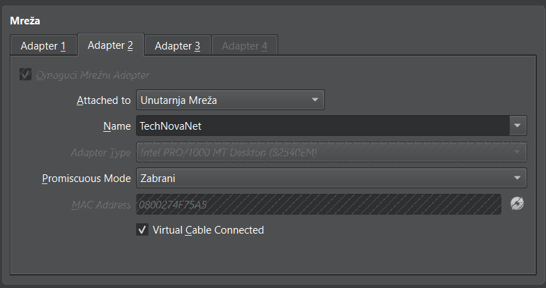
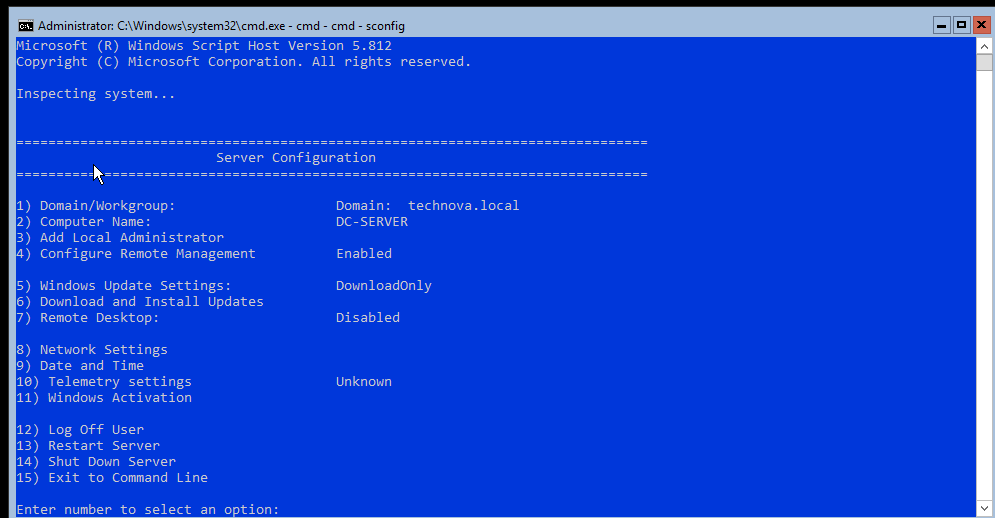
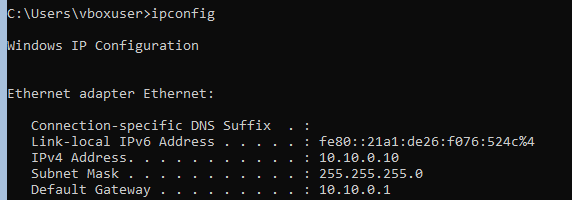
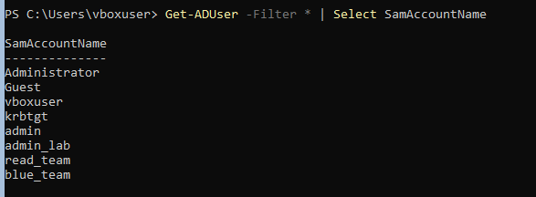
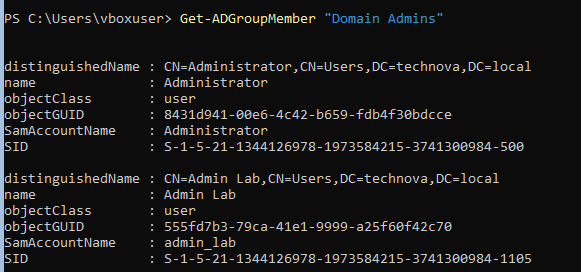
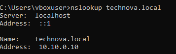
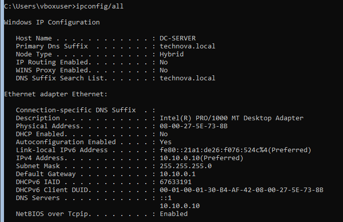
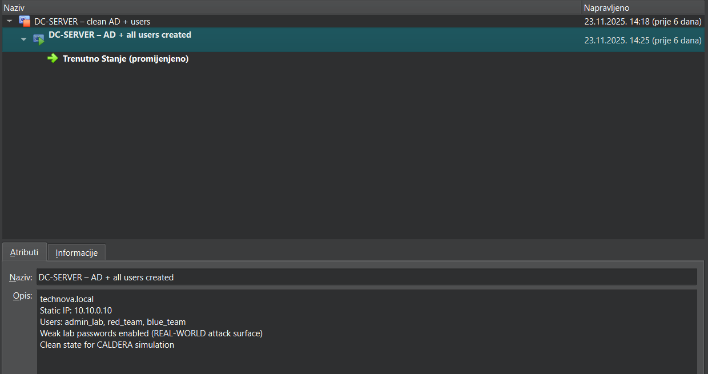

# Windows Server 2019 Domain Controller Setup – Detailed Guide

This document covers all steps performed to set up Windows Server 2019 as a Domain Controller, including:
- VM setup in VirtualBox
- Network configuration
- Vulnerabilities and why they were implemented
- Windows Server 2019 Core installation
- Configuration via sconfig
- Active Directory domain setup
- User creation
- Validation and snapshots
- All problems encountered and solutions

---

## 1. Creating Windows Server 2019 VM

### 1.1. Why This Server?

- This is the **Domain Controller (DC)** – the heart of an enterprise network.
- Handles authentication, DNS, security policies, and user management.
- Red Team attacks the DC, Blue Team defends it.

### 1.2. VM Specifications

```
OS: Windows Server 2019 Core (Eval)
CPU: 2 cores
RAM: 2–4 GB
Disk: 40GB VDI
Firmware: BIOS
Display: minimal (Core edition has no GUI)
```

**Reasoning:**
- Lightweight enough for laptop deployment
- Realistic for enterprise simulation

---

## 2. VirtualBox Network Configuration

### 2.1. Adapter 1 — Internal Network "TechNovaNet"

**Purpose:** Production network where DC + Workstations reside.

```
Attached to: Internal Network
Name: TechNovaNet
Promiscuous Mode: Allow All
Connected: ✔
```


*Figure 9: Internal Network adapter configuration for Domain Controller*

**Why?**
- This is your enterprise network simulated in VirtualBox.
- All servers must be connected exclusively through it.


## 3. Windows Server 2019 Core Installation

### 3.1. Boot from ISO

Started VM, enabled boot from ISO disk.

### 3.2. Unattended Installation

VirtualBox automatically configured:
- Local user: `vboxuser`
- Password: WinServer2019

**Purpose:** Quick automated installation.

### 3.3. Removing ISO

After installation, removed:
- Optical disk (ISO)

**Why?**
- If ISO isn't removed, server might boot into setup again.

---

## 4. Initial Startup and Configuration

After booting into cmd screen, launched:

```cmd
sconfig
```

This is the official Microsoft configuration menu.


*Figure 10: Server Configuration (sconfig) main menu*

---

## 5. Network Configuration (Critical Step)

Selected option:
```
8) Network settings
```

Windows Server had APIPA address (`169.254.x.x`) because it didn't receive DHCP.

### 5.1. Set Static IP Address

```
IP: 10.10.0.10
Mask: 255.255.255.0
Gateway: 10.10.0.1
```


*Figure 11: Static IP configuration for Domain Controller*

**Why?**
- Standard IP scheme for enterprise networks.
- Gateway is pfSense.

### 5.2. Set DNS

```
DNS1: 10.10.0.10 (the DC itself)
```

**Why must DC have itself as DNS?**
- AD DNS zones reside on the Domain Controller.
- All AD functionality depends on DNS.

### 5.3. Reboot

After changes – server rebooted.

---

## 6. Installing Active Directory Domain Services

Launched PowerShell.

### Adding AD Role:

```powershell
Install-WindowsFeature AD-Domain-Services -IncludeManagementTools
```

### Creating New Forest:

```powershell
Install-ADDSForest -DomainName "technova.local"
```

Server rebooted again.

**Why "technova.local"?**
- Internal domain name – realistic and appropriate for the project.


---

## 7. Implementing Weak Passwords (+ Why It's Important)

As part of realistic simulation, we implemented weaknesses:

### Weak Passwords:
- `Administrator1209!!`
- `BlueTeam2025!`
- `RedTeam2025!`

**Why?**
- Red Team will use password spraying / brute-force / Pass-the-Hash.
- MITRE ATT&CK includes techniques targeting weak passwords.
- In real environments, passwords are often weak.

**Security Note:**
These weaknesses are **intentional** for training purposes and map to:
- **T1078** (Valid Accounts)
- **T1110** (Brute Force)
- **T1003** (Credential Dumping)

---

## 8. Creating Users

Created users:
- `admin_lab` (Domain Admins)
- `blue_team`
- `red_team`

### PowerShell Commands:

```powershell
New-ADUser -Name "Admin Lab" -SamAccountName "admin_lab" `
  -AccountPassword (ConvertTo-SecureString "Administrator1209!!" -AsPlainText -Force) `
  -Enabled $true

New-ADUser -Name "Blue Team" -SamAccountName "blue_team" `
  -AccountPassword (ConvertTo-SecureString "BlueTeam2025!" -AsPlainText -Force) `
  -Enabled $true

New-ADUser -Name "Red Team" -SamAccountName "red_team" `
  -AccountPassword (ConvertTo-SecureString "RedTeam2025!" -AsPlainText -Force) `
  -Enabled $true
```

### Adding admin_lab to Domain Admins:

```powershell
Add-ADGroupMember -Identity "Domain Admins" -Members "admin_lab"
```

**Why?**
- `admin_lab` → used for AD administration
- `blue_team` → used for SIEM/EDR testing
- `red_team` → used for attack techniques



*Figure 12: Active Directory users created via PowerShell*

---

## 9. Creating Vulnerable User with Fine-Grained Password Policy

For realistic attack simulation (T1078 - Valid Accounts, T1110 - Brute Force, T1021 - SMB Lateral Movement), we need a user with intentionally weak password that bypasses default AD complexity requirements.

### 9.1. Why Fine-Grained Password Policy (FGPP)?

**Problem:** Default AD Domain Password Policy enforces complexity and minimum length for ALL users.

**Solution:** Fine-Grained Password Policy allows applying weaker password rules to specific users or groups while maintaining strong policies for others.

**Use Case:** Create `employee` user with password `employee` for attack simulations.

---

### 9.2. Creating the Weak Password Policy

**On Domain Controller (PowerShell as Administrator):**

```powershell
New-ADFineGrainedPasswordPolicy `
  -Name "CALDERA_WeakPolicy" `
  -MinPasswordLength 6 `
  -ComplexityEnabled $false `
  -PasswordHistoryCount 0 `
  -MaxPasswordAge (New-TimeSpan -Days 3650) `
  -Precedence 1
```

**Policy Settings:**
- `MinPasswordLength 6` - Allows short passwords
- `ComplexityEnabled $false` - No uppercase/lowercase/number/symbol requirements
- `PasswordHistoryCount 0` - Can reuse old passwords
- `MaxPasswordAge 3650 days` - Password never expires (10 years)
- `Precedence 1` - Highest priority when multiple policies apply

---

### 9.3. Creating the Vulnerable User

```powershell
New-ADUser -Name "Employee" -SamAccountName "employee" `
  -Enabled $false `
  -Description "Vulnerable user for attack simulation"
```

**Note:** User is created DISABLED initially - this is important for the next steps.

---

### 9.4. Applying Policy to User

```powershell
Add-ADFineGrainedPasswordPolicySubject `
  -Identity "CALDERA_WeakPolicy" `
  -Subjects employee
```

**Verification:**

```powershell
Get-ADUserResultantPasswordPolicy employee
```

**Expected Output:**
```
Name                  : CALDERA_WeakPolicy
MinPasswordLength     : 6
ComplexityEnabled     : False
PasswordHistoryCount  : 0
```

If you see `CALDERA_WeakPolicy` → policy is correctly applied.

---

### 9.5. Setting Weak Password (CRITICAL: Correct Order!)

**IMPORTANT: AD Security Mechanism**

Active Directory has a rule:
> "Disabled account may have any password, but Enabled account must have valid password at the moment of enabling."

**WRONG Order (will FAIL):**
1. Enable-ADAccount → FAIL (no valid password yet)
2. Set-ADAccountPassword → would work but account can't be enabled

**CORRECT Order:**
1. Set password FIRST (while user is still disabled)
2. Enable account SECOND

---

**Step 1: Set the Weak Password (user still DISABLED):**

```powershell
Set-ADAccountPassword `
  -Identity employee `
  -Reset `
  -NewPassword (ConvertTo-SecureString "employee" -AsPlainText -Force)
```

**Step 2: Enable the Account:**

```powershell
Enable-ADAccount -Identity employee
```

**Step 3: Verification:**

```powershell
Get-ADUser employee -Properties Enabled,LockedOut |
  Select Enabled, LockedOut
```

**Expected Output:**
```
Enabled   : True
LockedOut : False
```

---

### 9.6. Alternative Weak Passwords for Testing

You can also use these for different attack scenarios:

```powershell
# Password = username (very common weakness)
Set-ADAccountPassword -Identity employee -Reset `
  -NewPassword (ConvertTo-SecureString "employee" -AsPlainText -Force)

# Simple numeric
Set-ADAccountPassword -Identity employee -Reset `
  -NewPassword (ConvertTo-SecureString "employee123" -AsPlainText -Force)

# Classic weak passwords
Set-ADAccountPassword -Identity employee -Reset `
  -NewPassword (ConvertTo-SecureString "password" -AsPlainText -Force)

Set-ADAccountPassword -Identity employee -Reset `
  -NewPassword (ConvertTo-SecureString "qwerty" -AsPlainText -Force)
```

---

### 9.7. MITRE ATT&CK Mapping

This vulnerable user enables simulation of:

| Technique ID | Technique Name | Description |
|--------------|----------------|-------------|
| **T1078** | Valid Accounts | Using legitimate credentials |
| **T1110.001** | Brute Force: Password Guessing | Guessing weak passwords |
| **T1110.003** | Brute Force: Password Spraying | Trying common passwords |
| **T1021.002** | SMB/Windows Admin Shares | Lateral movement with valid creds |

---

### 9.8. Why Enable-ADAccount Failed Initially

**Root Cause Analysis:**

When attempting `Enable-ADAccount` before setting password:

1. AD checks if user has a valid password
2. Default Domain Policy requires complexity
3. User has no password → doesn't meet policy
4. AD refuses to enable account

**Error Message:**
```
Enable-ADAccount : The password does not meet the length, complexity, or history 
requirement of the domain.
```

**Solution:** Apply FGPP first, then set password (FGPP allows simple passwords), then enable.

---

### 9.9. Security Event Log Entries

After successful login with `employee` account, check Security Event Log:

**Event ID 4624** - Successful Logon
```
Account Name: employee
Account Domain: TECHNOVA
Logon Type: 10 (RemoteInteractive) or 3 (Network)
```

**Event ID 4625** - Failed Logon (if wrong password)
```
Account Name: employee
Failure Reason: Unknown user name or bad password
```

**Event ID 4740** - Account Locked Out (after too many failures)
```
Account Name: employee
Caller Computer Name: WIN-CLIENT
```

---

## 10. Problems and Solutions

### Problem: "Account already exists"

Attempted to create user `admin` which already exists on DC.

**Solution:** Used `admin_lab` instead of `admin`.

---

### Problem: DC cannot ping pfSense

**Reason:** pfSense VM was not running.

**Solution:** Start pfSense → ping works.

```cmd
ping 10.10.0.1
```

**Result:**  Reply from 10.10.0.1

---

### Problem: Enable-ADAccount fails with "password does not meet requirements"

**Symptoms:**
- Error when trying to enable user account
- "The password does not meet the length, complexity, or history requirement"

**Root Cause:** 
Trying to enable account BEFORE setting password that meets policy.

**Solution:** 
1. Apply Fine-Grained Password Policy to user first
2. Set password while account is still disabled
3. Then enable account

**Correct Command Sequence:**
```powershell
# 1. Apply weak policy
Add-ADFineGrainedPasswordPolicySubject -Identity "CALDERA_WeakPolicy" -Subjects employee

# 2. Set password (account still disabled)
Set-ADAccountPassword -Identity employee -Reset `
  -NewPassword (ConvertTo-SecureString "employee" -AsPlainText -Force)

# 3. Now enable
Enable-ADAccount -Identity employee
```

---

## 11. Validation (Verifying Everything Works)

###  Ping pfSense LAN:

```cmd
ping 10.10.0.1
```

**Result:** Successful

---

###  DNS Works:

```cmd
nslookup technova.local
ipconfig /all
```



*Figure 13: DNS resolution verification*

**Result:** DNS resolves correctly to `10.10.0.10`

---

### AD Structure Stable:

Server successfully rebooted after domain creation.

---

## 12. Snapshot (Golden State)

### Created Snapshot:

```
DC-SERVER – clean AD + users + vulnerable employee
```

**Why?**
- Return to initial state
- Repeat CALDERA campaigns
- Team work distribution


*Figure 14: VirtualBox snapshot of clean Domain Controller state*

---

## 13. Current Infrastructure State

The network now looks like this:

```
pfSense (10.10.0.1)
   |
   +--- Windows Server 2019 DC (technova.local) – 10.10.0.10
         |
         +--- Users: admin_lab, blue_team, red_team, employee (vulnerable)
```
