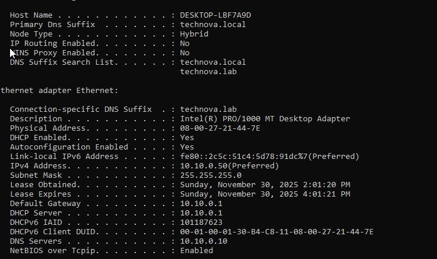
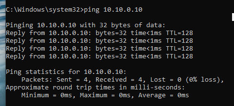
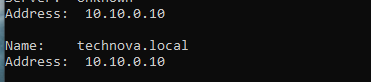
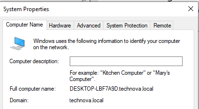
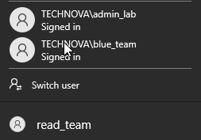

# Windows 10/11 Workstation Setup – Detailed Guide

This document covers all steps performed to set up a Windows Workstation in the TechNova Lab, including:
- VM creation in VirtualBox
- Network configuration
- Windows installation
- Domain join process
- Validation and testing
- Snapshot creation

---

## 1. Creating VM in VirtualBox

### Steps:

1. Open VirtualBox → **New**
2. Configure VM:
   ```
   Name: Win-CLIENT
   OS: Windows 10/11 (64-bit)
   RAM: 4 GB
   CPU: 2 cores
   Disk: 40 GB (VDI, Dynamically Allocated)
   ```

**Reasoning:**
- Sufficient resources for realistic workstation simulation
- Lightweight enough for multiple concurrent VMs

---

## 2. Network Adapter Configuration

### Adapter 1 (LAN via pfSense):

```
Type: Internal Network
Name: TechNovaNet
Promiscuous Mode: Allow All
Connected: ✔
```


*Figure 15: Internal Network adapter configuration*

---

## 3. Attaching Windows ISO

### Steps:

1. **Settings → Storage → Controller: SATA** → blue disk icon
2. **Choose a disk file**
3. Select Windows 10 ISO


---

## 4. Windows Installation

### Installation Process:

1. Start VM
2. Go through setup manually
3. **Skip Product Key** if prompted (Eval version)
4. Create **local account**
   - Username: `vboxuser` 
   - Password: Weak password allowed for simulation (e.g., `WinServer2019`)
5. Complete setup

### After First Boot:

**Remove ISO:**
- Settings → Storage → Remove ISO from SATA port

**Why?**
- Prevents accidental boot into installation again

---

## 5. Network Adapter Verification

### Check Network Status:

Open CMD or PowerShell:

```cmd
ipconfig /all
```

**Expected before DHCP:**
- Ethernet adapter Internal Network: `169.254.x.x` (APIPA)

---

## 6. Obtaining IP Address from pfSense DHCP

### Prerequisites:

- **pfSense must be running**

### Steps:

```cmd
ipconfig /release
ipconfig /renew
```

### Expected Result:

```
IPv4 Address: 10.10.0.x (from DHCP range 10.10.0.50-200)
Subnet Mask: 255.255.255.0
Default Gateway: 10.10.0.1 (pfSense)
DNS Server: 10.10.0.10 (DC)
```


*Figure 16: Network adapter with valid IP from pfSense DHCP*

---

## 7. Manual DNS Configuration (If Needed)

If pfSense doesn't provide correct DNS automatically:

### Steps:

1. **Control Panel → Network and Sharing Center**
2. **Change adapter settings**
3. **Ethernet → Properties → IPv4 → Properties**
4. Set DNS manually:
   ```
   Preferred DNS: 10.10.0.10
   ```

---

## 8. Communication Testing

### Test 1: Ping pfSense LAN

```cmd
ping 10.10.0.1
```

**Expected:**  Reply from 10.10.0.1

---


*Figure 17: Ping test for pfSense LAN*

### Test 2: Ping Domain Controller

```cmd
ping 10.10.0.10
```

**Expected:**  Reply from 10.10.0.10

---


*Figure 18: Ping test for Domain Controller*
### Test 3: DNS Lookup for Domain

```cmd
nslookup technova.local
```

**Expected Result:**
```
Server: 10.10.0.10
Address: 10.10.0.10

Name: technova.local
Address: 10.10.0.10
```


*Figure 19: DNS lookup verification for technova.local domain*

---

## 9. Changing Hostname

### Steps:

1. **Control Panel → System → Rename this PC**
2. New name: `WIN-CLIENT`
3. **Reboot**


---

## 10. Joining the Domain

### Steps:

1. **System Properties → Computer Name → Change**
2. Select **Domain** radio button
3. Enter: `technova.local`
4. Click **OK**

### Credentials Prompt:

```
Username: admin_lab
Password: Administrator1209!!
```


*Figure 20: Joining technova.local domain*

### Expected Result:

**Message:** "Welcome to the technova.local domain"


### Reboot

System will reboot automatically.

---

## 11. Testing Domain Login

### Login Screen:

1. Click **Other user**
2. Test with domain accounts:

```
TECHNOVA\admin_lab
Password: Administrator1209!!
```

```
TECHNOVA\blue_team
Password: BlueTeam0987!!
```

```
TECHNOVA\read_team
Password: ReadTeam1234??
```


*Figure 21: Domain login screen with TECHNOVA domain*

**Expected:**  Successful login with domain credentials

---

## 11. Vulnerable User Login (Attack Simulation)

### 11.1. Employee Account (Weak Credentials)

This account was created on the Domain Controller with intentionally weak password for attack simulations.

**Login Credentials:**

```
Username: TECHNOVA\employee
Password: employee
```

### 11.2. Login via Windows GUI

1. On Windows 10/11 Workstation login screen
2. Click **Other user**
3. Enter: `TECHNOVA\employee`
4. Password: `employee`
5. Press Enter

**Expected:** Successful login to Windows desktop

---

### 11.3. Login via RDP (Remote Desktop)

**From another machine:**

1. Open Remote Desktop Connection
2. Computer: `10.10.0.50` (or Tailscale IP)
3. Username: `TECHNOVA\employee`
4. Password: `employee`

**PowerShell command:**
```powershell
mstsc /v:10.10.0.50
```

---


## 12. Snapshot Creation

### Creating Golden State Snapshot:

1. **VirtualBox → Machine → Take Snapshot**
2. Snapshot details:
   ```
   Name: WIN-CLIENT – clean domain join
   Description: 10.10.0.x, joined to technova.local, basic configuration
   ```

**Why?**
- Quick reset to clean state
- Repeatable attack scenarios
- Team collaboration baseline

---

## 13. Current Infrastructure State

Your network now includes:

```
pfSense (10.10.0.1)
   |
   +--- Windows Server 2019 DC (technova.local) – 10.10.0.10
   |
   +--- Windows 10/11 Workstation (WIN-CLIENT) – 10.10.0.x
```

---

## 14. Common Issues and Solutions

###  Problem: Cannot get IP from DHCP

**Symptoms:**
- IP stays at 169.254.x.x

**Solutions:**
1. Verify pfSense is running
2. Check DHCP is enabled on pfSense LAN
3. Verify network adapter is on TechNovaNet
4. Try manual IP configuration temporarily

---

###  Problem: Cannot ping DC

**Symptoms:**
- Request timed out when pinging 10.10.0.10

**Solutions:**
1. Verify DC VM is running
2. Check DC firewall settings
3. Verify both VMs on same Internal Network

---

###  Problem: Domain join fails

**Symptoms:**
- "Domain could not be contacted"

**Solutions:**
1. Verify DNS is set to 10.10.0.10
2. Test DNS with: `nslookup technova.local`
3. Verify DC is reachable: `ping 10.10.0.10`
4. Check domain name spelling

---

###  Problem: "The specified domain either does not exist or could not be contacted"

**Root Cause:** DNS not pointing to DC

**Solution:**
Manually set DNS to 10.10.0.10 in adapter properties

---
