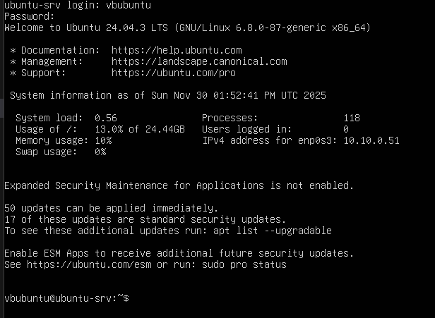
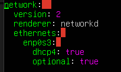
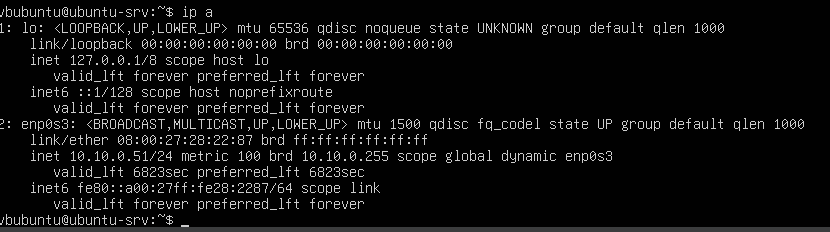
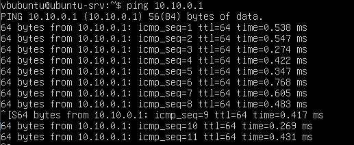
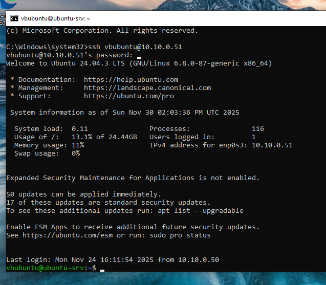
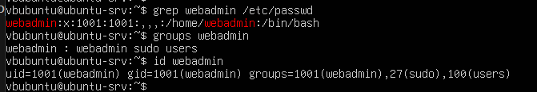
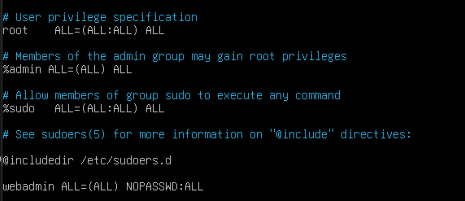
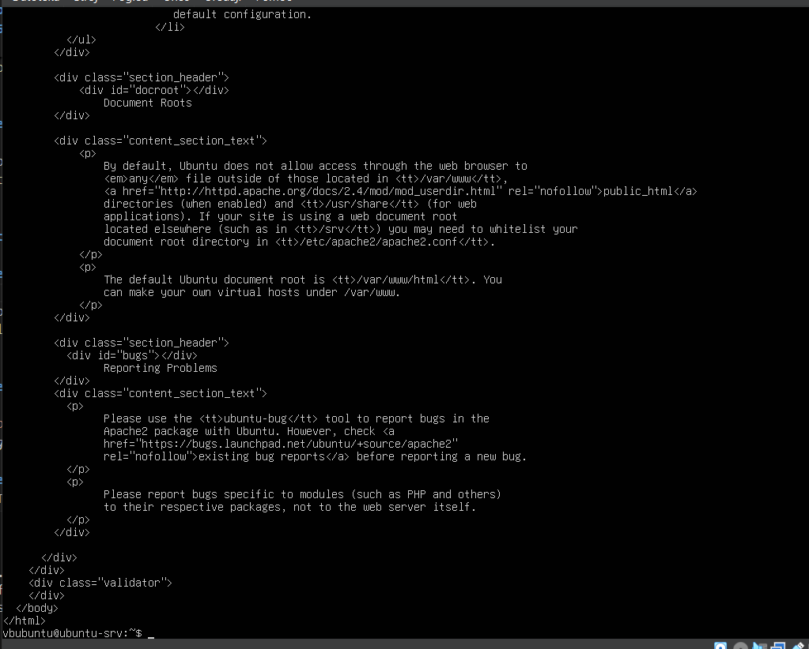
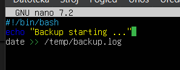
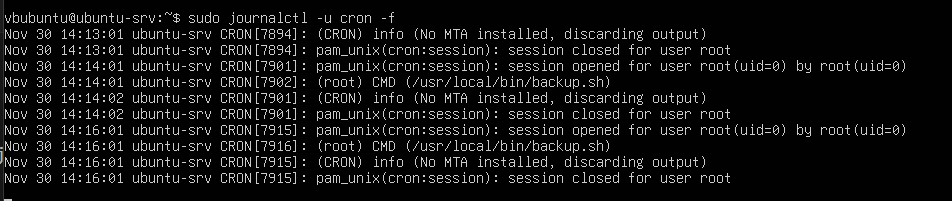

# Ubuntu Linux Server Setup – Detailed Guide 

This document covers all steps performed to set up Ubuntu Server as a vulnerable target system, including:
- VM creation and configuration
- Ubuntu Server 24.04 LTS installation
- Network configuration with Netplan
- Intentional vulnerabilities implementation
- Service deployment (SSH, Apache)
- Privilege escalation vectors
- Validation and snapshot

---

## 1. Linux Server Role in TechNova Lab

The Linux server serves as:
- **Application/service server** within TechNovaNet internal network (10.10.0.0/24)
- **Initial foothold target** for Red Team (SSH/web)
- **Privilege escalation** practice location (sudo NOPASSWD, cron)
- **Log source** for future SIEM (Wazuh / other tools)

**Goal:** Have a realistic but controlled Linux host with several typical vulnerabilities that appear in production environments.

---

## 2. Creating VM in VirtualBox

### 2.1. Basic VM Settings

```
VM Name: Ubuntu-Server
Type: Linux
Version: Ubuntu (64-bit)
RAM: 2 GB (or more as available)
CPU: 1-2 vCPU
Disk: 20 GB VDI (dynamic or fixed)
```


### 2.2. Network Adapter

Configuration:
```
Adapter 1: Internal Network
Network Name: TechNovaNet
Adapter Type: Intel PRO/1000 MT Desktop (82540EM)
Promiscuous Mode: Deny (not an IDS sensor, just a regular host)
Cable Connected: ✔
```


*Figure 30: Internal Network adapter configuration for Ubuntu Server*

**Result:**
Server is placed in the same internal network as:
- pfSense (LAN segment)
- DC-SERVER (10.10.0.10)
- Windows Workstation (10.10.0.50)

---

## 3. Ubuntu Server 24.04 LTS Installation

### 3.1. ISO and Boot

1. Downloaded **Ubuntu Server 24.04.3 LTS ISO**
2. In VirtualBox: **Settings → Storage → SATA Controller → Optical Drive**
3. Attached ISO
4. Booted VM from ISO

### Installation Process:

```
Language: English
Keyboard layout: English (US)
Installation type: Minimal server install
No additional snap packages
```

### 3.2. User Account Creation

During installation, created local user:
```
Username: vbubuntu
Password: UbuntuServer2025
```

After installation completed and first boot:
```
Ubuntu-Server login: vbubuntu
Password: ********
```


*Figure 31: Ubuntu Server TTY login screen*

### 3.3. Removing ISO

After OS installed and booted from disk:
1. **VirtualBox Settings → Storage**
2. Removed ISO from optical drive (empty drive)
3. Ensures VM boots from VDI disk going forward

---

## 4. Network Configuration – TechNovaNet (10.10.0.0/24)

### 4.1. Initial State Check

Checked network interfaces:

```bash
ip a
```

**Result:**
- `lo` – loopback
- `enp0s3` – Ethernet adapter in DOWN state, no IP address

### 4.2. Netplan Configuration

Ubuntu Server 24.04 uses Netplan. Created custom configuration.

#### Steps:

1. **Create new netplan file:**

```bash
sudo nano /etc/netplan/01-netcfg.yaml
```

2. **Add DHCP configuration for enp0s3:**

```yaml
network:
  version: 2
  renderer: networkd
  ethernets:
    enp0s3:
      dhcp4: true
      optional: true
```


*Figure 32: Netplan YAML configuration file*

3. **Save file** (Ctrl+O, Enter, Ctrl+X)

4. **Verify and apply:**

```bash
sudo netplan generate
sudo netplan apply
```

**Note:** If indentation error occurs, ensure all spaces are aligned exactly as shown above.

### 4.3. Result – IP Address from pfSense DHCP

Checked network again:

```bash
ip a
```

**Result:**
- `enp0s3` is now **UP** with IP address: `10.10.0.51/24` (assigned by pfSense DHCP on LAN)


*Figure 33: Network interface with IP from pfSense DHCP*

#### Connectivity Test:

```bash
ping 10.10.0.1    # pfSense LAN gateway
```

**Result:**  Successful replies confirm Linux server is in TechNovaNet segment

---

## 5. Basic Packages and SSH Access

### 5.1. System Update

First package refresh:

```bash
sudo apt update
sudo apt upgrade -y
```

**Purpose:**
- Basic security patches
- Consistent state before installing additional services

### 5.2. SSH Server Installation

Installed OpenSSH server:

```bash
sudo apt install -y openssh-server
```

**Service check:**

```bash
systemctl status ssh
```

**Status:** Service is enabled but inactive (dead) until connection arrives – uses socket activation. This is normal: sshd starts when someone tries to connect.

### 5.3. SSH Access Test from Windows Workstation

On Windows Workstation (10.10.0.50), in Command Prompt:

```cmd
ssh vbubuntu@10.10.0.51
```

**First connection:**
- Windows warned about authenticity (fingerprint) → confirmed with `yes`
- Entered password for `vbubuntu` and got shell


*Figure 34: Successful SSH connection from Windows Workstation*

**Confirmed:**
- pfSense passes traffic within TechNovaNet
- SSH works
- Red Team can later use same channel for foothold

---

## 6. Intentional Vulnerabilities on Linux Server

This is the core section: intentional weaknesses added to make the lab realistic.

### 6.1. Vulnerable User `webadmin` (+ sudo NOPASSWD)

#### 6.1.1. Adding User

Created new user:

```bash
sudo adduser webadmin
```

**Password:** `Webadmin123!` (weak, easily guessable pattern + word)

Added to sudo group:

```bash
sudo usermod -aG sudo webadmin
```

*Figure 34: Successful user creation*

#### 6.1.2. Sudo NOPASSWD (Privilege Escalation Paradise)

Opened sudoers file via visudo:

```bash
sudo visudo
```

Added at the end:

```
webadmin ALL=(ALL) NOPASSWD:ALL
```


*Figure 35: Sudoers configuration allowing passwordless sudo*

**Result:**
`webadmin` can:
- Run any command as root
- Without re-entering password

**Verification:**

```bash
sudo -l -U webadmin
```

**Output:**
```
User webadmin may run the following commands on ubuntu-srv:
    (ALL : ALL) ALL
    (ALL) NOPASSWD: ALL
```

**Security Impact:**
This is a very strong intentional vulnerability for Red Team:
- Once they get webadmin shell (e.g., SSH brute force, web shell), they immediately have root

**MITRE ATT&CK Mapping:**
- **T1548.003** - Sudo and Sudo Caching
- **T1078** - Valid Accounts

---

### 6.2. Weak SSH (Password Authentication)

Through `/etc/ssh/sshd_config.d` configuration, left `PasswordAuthentication yes`.

Although `PermitRootLogin` wasn't explicitly changed, the fact that:
- SSH accepts passwords
- User `webadmin` exists with weak password

Makes server vulnerable to:
- Brute-force attacks
- Credential stuffing
- Password spraying

**MITRE ATT&CK Mapping:**
- **T1110.001** - Brute Force: Password Guessing
- **T1110.003** - Brute Force: Password Spraying

---

### 6.3. Apache HTTP Server (Web Attack Surface)

Installed Apache2:

```bash
sudo apt install -y apache2
```

**Service check:**

```bash
systemctl status apache2
```

**Status:** active (running)

**Test from server:**

```bash
curl http://localhost
```

**Result:** HTML content of default Ubuntu Apache page displayed in terminal.


*Figure 36: Apache2 default page accessible on port 80*

**Security Impact:**
- HTTP port 80 listening on 0.0.0.0
- pfSense within internal network can forward traffic
- Red Team can later attempt web exploits

**MITRE ATT&CK Mapping:**
- **T1190** - Exploit Public-Facing Application

---

### 6.4. Cron Job as Root (Potential Persistence / PrivEsc Point)

Created cron job that executes every minute as root, calling a script from `/usr/local/bin`.

#### 6.4.1. Script File

Created script:

```bash
sudo nano /usr/local/bin/backup.sh
```

**Content:**

```bash
#!/bin/bash

# Demo "backup" script – intentionally insecure
# writes log to /tmp/backup.log

echo "Backup starting..." >> /tmp/backup.log
# (normally tar/rsync calls would go here)
```

Set execute permissions:

```bash
sudo chmod +x /usr/local/bin/backup.sh
```

#### 6.4.2. Cron Job for Root

Edited root cron:

```bash
sudo crontab -e
```

Added at end:

```
* * * * * /usr/local/bin/backup.sh
```

**Meaning:** Every minute, root executes `backup.sh`


*Figure 37: Root cron job configuration*

#### 6.4.3. Cron Activity Verification

Journalctl output showed periodic CRON entries:

```bash
sudo journalctl -u cron -f
```


**Result:** Execution of `/usr/local/bin/backup.sh` every 60 seconds observed.

**Security Impact:**
Perfect point for Red Team:
- If script or directory permissions are weak
- Can inject own payload that executes as root

**MITRE ATT&CK Mapping:**
- **T1053.003** - Scheduled Task/Job: Cron
- **T1068** - Exploitation for Privilege Escalation

---

### 6.5. Directory Listing in Apache

In `/var/www/html` left default content without Apache hardening configuration.

Directory listing enabled (depending on configuration):
- Can additionally add `Options Indexes` in virtual host
- Default page already provides enough information

**Security Impact:**
Red Team can see web root structure and any additional files.

---

## 7. Snapshot and Use in CALDERA Lab

After Linux server brought to desired "vulnerable but functional" state:

### Snapshot Creation:

1. In VirtualBox, shut down or pause VM
2. Open **Snapshots** for Ubuntu-Server VM
3. Create snapshot with name:
   ```
   Ubuntu-SRV – vulnerable baseline
   ```

**Description:**
```
IP: 10.10.0.51
DHCP from pfSense
Users: vbubuntu, webadmin (NOPASSWD)
Services: SSH, Apache, cron backup
Intentional vulnerabilities implemented
```


**Purpose:**
- Golden image for repeating attacks
- Restore point if something breaks during testing
- Reference in project report

---


## 8. Current Infrastructure State

Your network now includes:

```
pfSense (10.10.0.1)
   |
   +--- Windows Server 2019 DC (technova.local) – 10.10.0.10
   |
   +--- Windows 10/11 Workstation (WIN-CLIENT) – 10.10.0.x
   |
   +--- Ubuntu Server (ubuntu-srv) – 10.10.0.51
```

---


