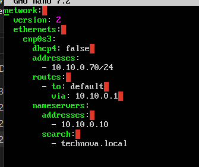
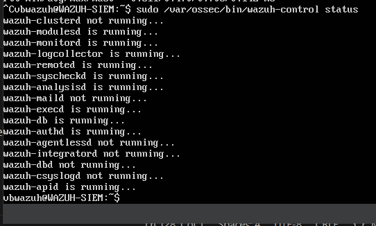
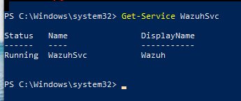
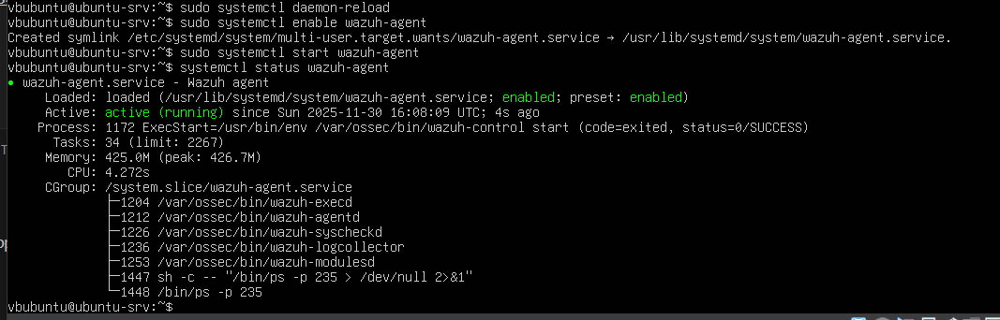
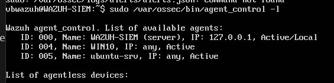
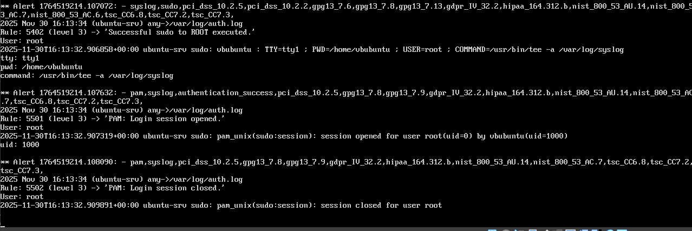

# Mini-Wazuh SIEM – Installation and Integration Guide

This document describes setting up a Mini-Wazuh SIEM system optimized for running on a laptop with 16 GB RAM. The version is adapted for your lab, minimal (2 GB RAM), and enables log monitoring from:
- Windows Workstation
- Ubuntu Vulnerable Server
- Domain Controller (optional)

Mini-Wazuh uses only Wazuh Manager + minimal components, without full ElasticSearch stack, drastically reducing RAM consumption.

---

## 1. Creating VirtualBox VM (WAZUH-SIEM)

### 1.1. VM Setup

```
Name: WAZUH-SIEM
OS Type: Ubuntu (64-bit)
RAM: 2048 MB
CPU: 2 cores
Disk: 40 GB (VDI, dynamically allocated)
```


### 1.2. Network Settings

```
Adapter 1: Internal Network → TechNovaNet
Promiscuous Mode: Deny
Cable Connected: ✔
```


*Figure 41: Internal Network adapter configuration for Wazuh SIEM*

### 1.3. Loading ISO

Use the same Ubuntu Server ISO as for Linux server and CALDERA.

---

## 2. Ubuntu Server Installation (Minimal Setup)

During installation:
```
Username: vbwazuh
Password: Wazuh!$1
Include: OpenSSH Server
Additional packages: None
```

---

## 3. Static IP Configuration

VM must have a fixed IP address, for example: `10.10.0.70`

### Editing  Configuration

```bash
sudo nano /etc/netplan/00-installer'config.yaml
```

### Configuration:

```yaml
network:
  version: 2
  ethernets:
    enp0s3:
      dhcp4: false
      addresses:
        - 10.10.0.70/24
      routes:
        - to: default
          via: 10.10.0.1
      nameservers:
        addresses:
          - 10.10.0.10
        search: 
          - technova.local
```


*Figure 42: Static IP configuration for Wazuh SIEM*

### Apply Configuration:

```bash
sudo netplan apply
ip a
```

### Verify Connectivity:

```bash
ping 10.10.0.10    # Domain Controller
ping 10.10.0.20    # Windows Workstation
ping 10.10.0.51    # Linux Server
```

---

## 4. Installing Mini-Wazuh SIEM System

### 4.1. Why Mini-Wazuh?

Laptop has 16 GB RAM, but you're running multiple VMs. Full Wazuh (Manager + Indexer + Dashboard) requires minimum 6-8 GB RAM.

**Mini-Wazuh solution:**
- No GUI
- No OpenSearch Dashboards
- Only Wazuh Manager + minimal components
- All detections available via logs
- RAM usage: ~2 GB

### 4.2. Installing Wazuh Manager

```bash
curl -s https://packages.wazuh.com/key/GPG-KEY-WAZUH | sudo gpg --no-default-keyring --keyring gnupg-ring:/usr/share/keyrings/wazuh.gpg --import && sudo chmod 644 /usr/share/keyrings/wazuh.gpg

echo "deb [signed-by=/usr/share/keyrings/wazuh.gpg] https://packages.wazuh.com/4.x/apt/ stable main" | sudo tee -a /etc/apt/sources.list.d/wazuh.list

sudo apt-get update
sudo apt install -y wazuh-manager
```


### 4.3. Verify Installation:

```bash
sudo /var/ossec/bin/wazuh-control status
```

**Expected output:**
```
wazuh-modulesd is running...
wazuh-logcollector is running...
wazuh-remoted is running...
wazuh-analysisd is running...
```

*Figure 43: Wazuh services running*

### 4.4. Important Log Locations

**Main JSON alert file:**
```
/var/ossec/logs/alerts/alerts.json
```

**Text alert log:**
```
/var/ossec/logs/alerts/alerts.log
```

**Manager internal log:**
```
/var/ossec/logs/ossec.log
```

---


## 5. Installing Agents on Target VMs

### 5.1. Windows Workstation Agent

#### 5.1.1. Download and Install (PowerShell as Administrator)

```powershell
Invoke-WebRequest -Uri https://packages.wazuh.com/4.x/windows/wazuh-agent-4.7.5-1.msi -OutFile wazuh-agent.msi

msiexec /i wazuh-agent.msi /q ADDRESS="10.10.0.70" AUTHD_SERVER="10.10.0.70" GROUP="windows"
```

#### 5.1.2. Configure Agent (if needed)

Edit: `C:\Program Files (x86)\ossec-agent\ossec.conf`

```xml
<server>
  <address>10.10.0.70</address>
</server>
```

#### 5.1.3. Start and Enable Service

```powershell
Start-Service WazuhSvc
Set-Service WazuhSvc -StartupType Automatic
```

**Verification:**

```powershell
Get-Service WazuhSvc
```


*Figure 44: Wazuh service running on Windows*

---

### 5.2. Linux Server Agent

#### 5.2.1. Download Agent Package

```bash
curl -O https://packages.wazuh.com/4.x/apt/pool/main/w/wazuh-agent/wazuh-agent_4.7.5-1_amd64.deb
```

**Important:** If file is only 111 bytes → it's an HTML error page

**Solution:** Re-download with proper flags:
```bash
curl -O -L https://packages.wazuh.com/4.x/apt/pool/main/w/wazuh-agent/wazuh-agent_4.7.5-1_amd64.deb
```

#### 5.2.2. Install Package

```bash
sudo dpkg -i wazuh-agent_4.7.5-1_amd64.deb
sudo apt --fix-broken install -y
```

#### 5.2.3. Configure Agent

```bash
sudo nano /var/ossec/etc/ossec.conf
```

**Add/Edit server address:**

```xml
<server>
  <address>10.10.0.70</address>
</server>
```

#### 5.2.4. Start and Enable Agent

```bash
sudo systemctl daemon-reload
sudo systemctl enable wazuh-agent
sudo systemctl start wazuh-agent
```

**Verify status:**

```bash
systemctl status wazuh-agent
```


*Figure 45: Wazuh agent service status on Linux*

---

## 6. Agent Registration in SIEM

### 6.1. Manual Registration (Most Reliable Method)

**On SIEM server:**

```bash
sudo /var/ossec/bin/manage_agents
```

**Menu options:**
- **A** → Add agent
- Enter agent name (e.g., `WIN-CLIENT` or `ubuntu-srv`)
- Enter IP address
- **E** → Extract key

**On Windows agent:**
```powershell
cd "C:\Program Files (x86)\ossec-agent"
.\agent-auth.exe -m 10.10.0.70
```

**On Linux agent:**
```bash
sudo /var/ossec/bin/agent-auth -m 10.10.0.70
```

### 6.2. Verify Connected Agents

**On SIEM server:**

```bash
sudo /var/ossec/bin/agent_control -l
```

**Expected output:**

```
Available agents:
   ID: 001, Name: WIN-CLIENT, IP: 10.10.0.50, Active
   ID: 002, Name: ubuntu-srv, IP: 10.10.0.51, Active
```


*Figure 646 List of connected agents in Wazuh*

---

## 7. Testing SIEM Functionality

### 7.1. Windows Test Events

**PowerShell:**

```powershell
# Test file integrity monitoring
mkdir C:\wazuh_test
New-Item C:\wazuh_test\test.txt -ItemType File
Remove-Item C:\wazuh_test\test.txt -Force
Remove-Item C:\wazuh_test -Recurse -Force
```

**Generate Windows Event:**

```powershell
eventcreate /ID 100 /L APPLICATION /T WARNING /SO Test /D "Wazuh test event"
```

### 7.2. Linux Test Events

```bash
# File integrity test
sudo touch /root/hacker.txt
sudo rm /root/hacker.txt

# Syslog test
echo "Test Wazuh log entry" | sudo tee -a /var/log/syslog
```

### 7.3. Real-time Monitoring

**On SIEM server:**

```bash
sudo tail -f /var/ossec/logs/alerts/alerts.log
```


*Figure 47: Real-time alert monitoring in Wazuh logs*

**View JSON format:**

```bash
sudo tail -f /var/ossec/logs/alerts/alerts.json
```

---


## 8. Architecture Summary

### Complete TechNovaNet Environment:

```
pfSense (10.10.0.1)
   |
   +--- Windows Server 2019 DC (technova.local) – 10.10.0.10
   |
   +--- Windows 10 Workstation (WIN-CLIENT) – 10.10.0.50
   |    └── Wazuh Agent (ID: 001)
   |    └── CALDERA Sandcat Agent
   |
   +--- Ubuntu Server (ubuntu-srv) – 10.10.0.51
   |    └── Wazuh Agent (ID: 002)
   |    └── CALDERA Sandcat Agent
   |
   +--- CALDERA Server (CALDERA-SRV) – 10.10.0.60
   |
   +--- Wazuh SIEM (WAZUH-SIEM) – 10.10.0.70
        └── Wazuh Manager
        └── Alert Logs
```

### Data Flow:

```
[CALDERA] --attacks--> [Windows/Linux Targets]
                              |
                              v
                        [Wazuh Agents]
                              |
                              v
                        [Wazuh Manager]
                              |
                              v
                    [Alert Logs & Analysis]
```

---

## 9. Snapshot Creation

### Creating Wazuh SIEM Snapshot:

```
Name: WAZUH-SIEM – operational baseline
Description: IP 10.10.0.70, Wazuh Manager installed, agents connected
```


