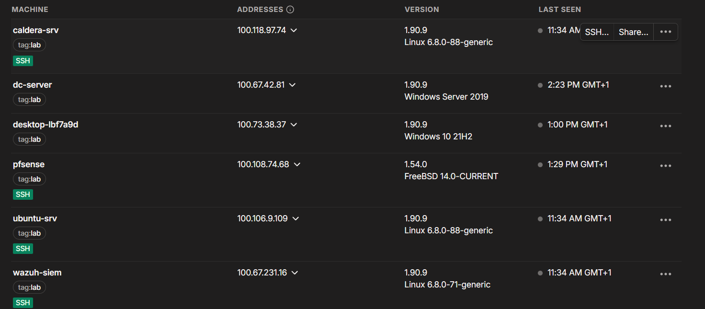
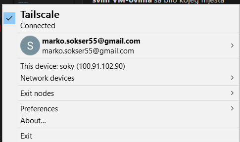
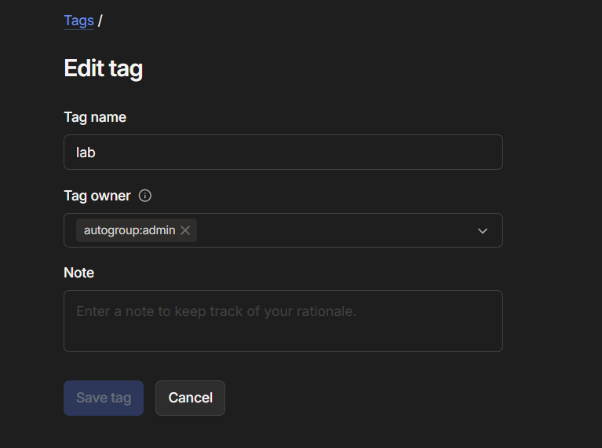
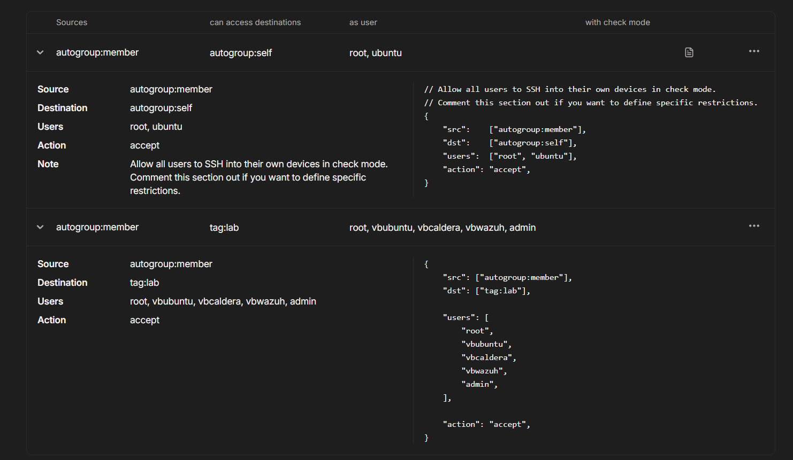

# Tailscale VPN + Remote Access Setup Guide

This document describes complete setup of secure remote access to all TechNova Lab virtual machines using Tailscale VPN and SSH/RDP protocols.

**Purpose:** Enable secure team access to all lab VMs without port forwarding, public IP addresses, or complex tunneling.

---

## Table of Contents

1. [Overview and Architecture](#1-overview-and-architecture)
2. [Tailscale Installation](#2-tailscale-installation)
3. [SSH Server Configuration](#3-ssh-server-configuration)
4. [Team Access Methods](#4-team-access-methods)
5. [Tailscale ACL Configuration](#5-tailscale-acl-configuration)
6. [Connection Examples](#6-connection-examples)
7. [Troubleshooting](#7-troubleshooting)
8. [Security Considerations](#8-security-considerations)

---

## 1. Overview and Architecture

### 1.1. Why Tailscale?

**Advantages:**
- No port forwarding required
- No public IP exposure
- Works behind NAT and firewalls
- Zero-config mesh VPN
- End-to-end encrypted
- Cross-platform (Windows, Linux, macOS, mobile)

**Use Case:**
Team members need secure access to lab VMs from anywhere without exposing infrastructure to the internet.

---

### 1.2. Network Architecture

```
┌─────────────────────────────────────────────────────────────┐
│                 Tailscale Overlay Network                    │
│                   (100.x.x.x addresses)                      │
└─────────────────────────────────────────────────────────────┘
                         │
        ┌────────┬───────┼──────┬──────────┬──────────┐
        │        │       │      │          │          │
    ┌───┴───┐ ┌─┴──┐ ┌──┴──┐ ┌─┴───┐  ┌───┴────┐ ┌───┴────┐
    │pfSense│ │ DC │ │Win  │ │Linux│  │CALDERA │ │ Wazuh  │
    │SSH    │ │RDP │ │ SSH │ │ SSH │  │  SSH   │ │  SSH   │
    └───────┘ └────┘ └─────┘ └─────┘  └────────┘ └────────┘
```

---

### 1.3. Tailscale IP Addresses 

Based on your Tailscale interface, the following IP addresses are assigned:

| Machine | Tailscale IP | Local IP | Access Method |
|---------|--------------|----------|---------------|
| **caldera-srv** | `100.118.97.74` | 10.10.0.60 | SSH (port 22) |
| **dc-server** | `100.67.42.81` | 10.10.0.10 | RDP (port 3389) |
| **desktop-lbf7a9d** | `100.73.38.37` | 10.10.0.50 | SSH (port 22) / RDP |
| **pfsense** | `100.108.74.68` | 10.10.0.1 | SSH (port 22) / Web GUI (443) |
| **ubuntu-srv** | `100.106.9.109` | 10.10.0.51 | SSH (port 22) |
| **wazuh-siem** | `100.67.231.16` | 10.10.0.70 | SSH (port 22) |



*Figure 47: Real-time alert monitoring in Wazuh logs*

**Important:** Use these **Tailscale IP addresses** (100.x.x.x) for all remote connections, NOT the local 10.10.0.x addresses.

---

## 2. Tailscale Installation

### 2.1. Windows 10/11 Workstation

#### Download and Install:

1. Download Tailscale MSI installer from: https://tailscale.com/download/windows
2. Run installer: `tailscale-setup-x.x.x.msi`
3. Complete installation



*Figure 48: Tailscale installation on Windows*

#### Verify Installation:

Open PowerShell:

```powershell
cd "C:\Program Files\Tailscale"
.\tailscale.exe version
```

**Expected output:**
```
1.90.9
```

#### Connect to Tailscale Network:

```powershell
.\tailscale.exe up
```

**This will:**
- Open browser for authentication
- Connect to Tailscale network
- Assign 100.x.x.x IP address


#### Verify Connection:

```powershell
.\tailscale.exe status
```

**Expected output shows:**
- Your machine's Tailscale IP
- All other connected machines

---

### 2.2. Linux VMs (Ubuntu Server, CALDERA, Wazuh)

#### Installation Script:

```bash
curl -fsSL https://tailscale.com/install.sh | sh
```

**This installs:**
- Tailscale daemon
- Tailscale CLI tools
- systemd service


#### Connect to Network:

```bash
sudo tailscale up
```

**Follow authentication link** in terminal output.

#### Verify Tailscale IP:

```bash
tailscale ip -4
```

**Expected output:**
```
100.x.x.x
```

#### Check Status:

```bash
tailscale status
```


---

### 2.3. pfSense Firewall

pfSense requires manual configuration as it runs FreeBSD.

#### Create Repository Configuration:

```bash
mkdir -p /usr/local/etc/pkg/repos
ee /usr/local/etc/pkg/repos/Tailscale.conf
```

**Add content:**

```
Tailscale: {
  url: "pkg+https://pkgs.tailscale.com/stable/freebsd",
  mirror_type: "srv",
  signature_type: "fingerprints",
  fingerprints: "/usr/local/etc/pkg/fingerprints/tailscale",
  enabled: yes
}
```

#### Import Tailscale Fingerprints:

```bash
mkdir -p /usr/local/etc/pkg/fingerprints/tailscale
fetch -o /usr/local/etc/pkg/fingerprints/tailscale/trusted \
  https://pkgs.tailscale.com/stable/freebsd/trusted
```

#### Install Tailscale Package:

```bash
pkg update
pkg install tailscale
```

#### Enable and Start Service:

```bash
service tailscaled enable
service tailscaled start
```

#### Connect to Network:

```bash
tailscale up --accept-dns=false --accept-routes --advertise-routes=10.10.0.0/24
```

**Flags explained:**
- `--accept-dns=false` - Don't override pfSense DNS
- `--accept-routes` - Accept routes from other Tailscale nodes
- `--advertise-routes=10.10.0.0/24` - Share TechNovaNet subnet (optional)

#### Verify Connection:

```bash
tailscale status
tailscale ip -4
```


## 3. SSH Server Configuration

### 3.1. Ubuntu Server (ubuntu-srv)

SSH server should already be installed. Verify:

```bash
sudo systemctl status ssh
```

**If not installed:**

```bash
sudo apt update
sudo apt install -y openssh-server
```

#### Enable and Start:

```bash
sudo systemctl enable ssh
sudo systemctl start ssh
```

#### Verify Listening:

```bash
sudo netstat -tulnp | grep :22
```

**Expected output:**
```
tcp        0      0 0.0.0.0:22              0.0.0.0:*               LISTEN      1234/sshd
```

#### Test Tailscale Connectivity:

```bash
tailscale ip -4
ping <your-client-tailscale-ip>
```

---

### 3.2. CALDERA Server

Same process as Ubuntu Server:

```bash
sudo systemctl status ssh
```

**If needed:**

```bash
sudo apt install -y openssh-server
sudo systemctl enable ssh
sudo systemctl start ssh
```

---

### 3.3. Wazuh SIEM Server

SSH already configured during setup. Verify:

```bash
sudo systemctl status ssh
```

---

### 3.4. Windows 10 Workstation (OpenSSH Server)

#### Install OpenSSH Server:

Open PowerShell as Administrator:

```powershell
Add-WindowsCapability -Online -Name OpenSSH.Server~~~~0.0.1.0
```

#### Start SSH Service:

```powershell
Start-Service sshd
Set-Service -Name sshd -StartupType Automatic
```

#### Configure Firewall:

```powershell
New-NetFirewallRule -Name sshd -DisplayName "OpenSSH Server (sshd)" `
  -Enabled True -Direction Inbound -Protocol TCP -Action Allow -LocalPort 22
```

#### Verify Service:

```powershell
Get-Service sshd
netstat -an | findstr :22
```

**Expected output:**
```
Status   Name               DisplayName
------   ----               -----------
Running  sshd               OpenSSH SSH Server

TCP    0.0.0.0:22             0.0.0.0:0              LISTENING
```

---

### 3.5. Windows Server 2019 DC

Windows Server Core doesn't have OpenSSH by default. Use RDP instead (see Section 4.3).

**Alternative:** Install OpenSSH via PowerShell (same commands as Windows 10).

---

### 3.6. pfSense SSH Access

SSH is enabled by default on pfSense. Access via:

```bash
ssh admin@<pfsense-tailscale-ip>
```

---

## 4. Team Access Methods

### 4.1. SSH Access Pattern

**General format:**

```bash
ssh <username>@<tailscale-ip>
```

**Username** is the local user account on each VM (see Section 6 for specific examples).

---

### 4.2. RDP Access Pattern (Windows Systems)

**For Windows Workstation and DC:**

```
Remote Desktop Connection:
Computer: <tailscale-ip>:3389
Username: TECHNOVA\<domain-user>
Password: <domain-password>
```

**For Windows 10/11 Home editions:**
- RDP Wrapper required (not covered in this guide)
- Or use SSH instead

---

### 4.3. pfSense Web GUI Access

**URL:**

```
https://<pfsense-tailscale-ip>
```

```
https://100.108.74.68
```

**Credentials:**
```
Username: admin
Password: pfsense
```

---

## 5. Tailscale ACL Configuration

### 5.1. Tailscale Tags

Tags are used to organize and control access to lab machines.

#### Creating Tag in Tailscale Admin Console:

1. Go to: https://login.tailscale.com/admin/acls
2. Add tag definition:

```json
{
  "tagOwners": {
    "tag:lab": ["autogroup:admin"]
  }
}
```

#### Assigning Tag to Machines:

1. Go to: https://login.tailscale.com/admin/machines
2. Click on each VM
3. Add tag: `tag:lab`


*Figure 77: Assigning lab tag to machines*

---

### 5.2. Access Control Rules

**Allow team members to access all lab machines:**

```json
{
  "acls": [
    {
      "action": "accept",
      "src": ["autogroup:members"],
      "dst": ["tag:lab:*"]
    }
  ]
}
```
 
 
*Figure 77: Assigning SSH access to lab tag*

**This means:**
- All authenticated users (`autogroup:members`)
- Can access all ports (`*`)
- On all machines tagged with `tag:lab`


**Ports:**
- `22` - SSH
- `3389` - RDP
- `443` - HTTPS (pfSense, CALDERA)
- `8888` - CALDERA web interface

---

## 6. Connection Examples

Use the Tailscale IP addresses from your interface (as shown in the screenshot).

---

### 6.1. CALDERA Server

**Machine:** `caldera-srv`  
**Tailscale IP:** `100.118.97.74`  
**Local Username:** `vbcaldera`

#### SSH Connection:

```bash
ssh vbcaldera@100.118.97.74
```

**When prompted, enter password for `vbcaldera` account.**

#### Access CALDERA Web Interface:

**URL:**
```
http://100.118.97.74:8888
```

**Credentials:**
```
Username: read (or blue, or admin)
Password: admin
```

---

### 6.2. Domain Controller (Windows Server 2019)

**Machine:** `dc-server`  
**Tailscale IP:** `100.67.42.81`  
**Username:** `TECHNOVA\admin_lab` or local `vboxuser` or `red_team` or `blue_team`

#### RDP Connection:

**Windows Remote Desktop:**

1. Open Remote Desktop Connection
2. Computer: `100.67.42.81`
3. Username: `TECHNOVA\admin_lab` or `vboxuser` or `red_team` or `blue_team`
4. Password: `Administrator1209!!`  or `ReadTeam1234??` or `BlueTeam0987!!!`


#### Alternative SSH (if OpenSSH installed):

```bash
ssh vboxuser@100.67.42.81
```

---

### 6.3. Windows Workstation

**Machine:** `desktop-lbf7a9d`  
**Tailscale IP:** `100.73.38.37`  
**Local Username:** `vboxuser`  
**Domain Username:** `TECHNOVA\admin_lab`, `TECHNOVA\blue_team`, `TECHNOVA\read_team`

#### SSH Connection:

```bash
ssh vboxuser@100.73.38.37
```

**Or with domain account (if configured):**

```bash
ssh admin_lab@100.73.38.37
```

#### RDP Connection:

```
Computer: 100.73.38.37
Username: TECHNOVA\admin_lab
Password: Administrator1209!!
```

---

### 6.4. pfSense Firewall

**Machine:** `pfsense`  
**Tailscale IP:** `100.108.74.68`  
**Username:** `admin`

#### SSH Connection:

```bash
ssh admin@100.108.74.68
```

**Password:** `pfsense`


#### Web GUI Access:

**URL:**
```
https://100.108.74.68
```

**Credentials:**
```
Username: admin
Password: pfsense
```

**Note:** Browser will warn about self-signed certificate - this is normal.

---

### 6.5. Ubuntu Server (Vulnerable Target)

**Machine:** `ubuntu-srv`  
**Tailscale IP:** `100.106.9.109`  
**Username:** `vbubuntu`

#### SSH Connection:

```bash
ssh vbubuntu@100.106.9.109
```

**Password:** `UbuntuServer2025`

**Alternative vulnerable account (for Red Team exercises):**

```bash
ssh webadmin@100.106.9.109
```

**Password:** `Webadmin123!`


#### Access Apache Web Server:

**URL:**
```
http://100.106.9.109
```

---

### 6.6. Wazuh SIEM Server

**Machine:** `wazuh-siem`  
**Tailscale IP:** `100.67.231.16`  
**Username:** `vbwazuh`

#### SSH Connection:

```bash
ssh vbwazuh@100.67.231.16
```

**Password:** `Wazuh!$1`

#### Monitor Alerts in Real-Time:

After SSH login:

```bash
sudo tail -f /var/ossec/logs/alerts/alerts.log
```


---

## 7. Troubleshooting

### 7.1. Cannot Connect to Tailscale IP

**Symptoms:**
- Connection timeout
- No route to host

**Solutions:**

1. **Verify Tailscale is running on both machines:**

   ```bash
   tailscale status
   ```

2. **Check Tailscale IP addresses:**

   ```bash
   tailscale ip -4
   ```

3. **Test connectivity:**

   ```bash
   ping <target-tailscale-ip>
   ```

4. **Restart Tailscale service:**

   **Linux:**
   ```bash
   sudo systemctl restart tailscaled
   ```

   **Windows:**
   ```powershell
   Restart-Service Tailscale
   ```

---

### 7.2. SSH Connection Refused

**Symptoms:**
- `Connection refused`
- `Port 22: Connection refused`

**Solutions:**

1. **Verify SSH service is running:**

   **Linux:**
   ```bash
   sudo systemctl status ssh
   ```

   **Windows:**
   ```powershell
   Get-Service sshd
   ```

2. **Check if port 22 is listening:**

   **Linux:**
   ```bash
   sudo netstat -tulnp | grep :22
   ```

   **Windows:**
   ```powershell
   netstat -an | findstr :22
   ```

3. **Start SSH service if stopped:**

   **Linux:**
   ```bash
   sudo systemctl start ssh
   ```

   **Windows:**
   ```powershell
   Start-Service sshd
   ```

---

### 7.3. Authentication Failed

**Symptoms:**
- `Permission denied (publickey,password)`
- Wrong username or password

**Solutions:**

1. **Verify username for each machine:**
   - CALDERA: `ubcaldera`
   - Ubuntu Server: `vbubuntu`
   - Wazuh: `vbwazuh`
   - Windows: `vboxuser` or `TECHNOVA\admin_lab`
   - pfSense: `admin`

2. **Check password is correct** (refer to `00-credentials-and-access.md`)

3. **For domain accounts on Windows:**
   ```bash
   ssh TECHNOVA\\admin_lab@<tailscale-ip>
   ```
   (Note the double backslash for domain)

---

### 7.4. pfSense Web GUI Certificate Warning

**Symptoms:**
- Browser shows "Your connection is not private"
- SSL certificate error

**Solution:**

This is **normal** - pfSense uses self-signed certificate.

**Click:**
- Chrome: "Advanced" → "Proceed to 100.108.74.68 (unsafe)"
- Firefox: "Advanced" → "Accept the Risk and Continue"

---

### 7.5. RDP Connection Failed

**Symptoms:**
- Cannot connect via Remote Desktop
- Connection refused on port 3389

**Solutions:**

1. **Enable Remote Desktop on Windows:**

   **Settings → System → Remote Desktop → Enable**

2. **Check Windows Firewall:**

   ```powershell
   Get-NetFirewallRule -DisplayName "*Remote Desktop*" | Select DisplayName, Enabled
   ```

3. **Verify RDP service:**

   ```powershell
   Get-Service TermService
   ```

4. **Test port 3389:**

   ```powershell
   Test-NetConnection -ComputerName <tailscale-ip> -Port 3389
   ```

---

### 7.6. Tailscale Authentication Expired

**Symptoms:**
- Machine shows as offline in Tailscale admin
- `tailscale status` shows authentication error

**Solution:**

Re-authenticate:

```bash
sudo tailscale up
```

Follow authentication link in terminal.

---

## 8. Security Considerations

### 8.1. Advantages of Tailscale Access

 **No Port Forwarding:**
- Lab remains completely isolated from internet
- No exposed ports on router

 **End-to-End Encryption:**
- All traffic encrypted via WireGuard protocol
- Even Tailscale servers cannot decrypt traffic

 **Zero Trust Architecture:**
- Authentication required for every connection
- Access control per machine

**Audit Logs:**
- Tailscale admin console shows all connections
- Track who accessed what and when

---

### SSH Connection Examples:

```bash
# CALDERA
ssh vbcaldera@100.118.97.74

# Ubuntu Server
ssh vbubuntu@100.106.9.109

# Wazuh SIEM
ssh vbwazuh@100.67.231.16

# pfSense
ssh admin@100.108.74.68

# Windows Workstation
ssh vboxuser@100.73.38.37
```

### RDP Connection Examples:

```
# Domain Controller
100.67.42.81
TECHNOVA\admin_lab / Administrator1209!!

# Windows Workstation
100.73.38.37
TECHNOVA\admin_lab / Administrator1209!!
```

### Web Interfaces:

```
# CALDERA
http://100.118.97.74:8888

# pfSense
https://100.108.74.68

# Ubuntu Apache
http://100.106.9.109
```

---

## 10. Team Collaboration Workflow

### For Red Team:

1. **Connect to Tailscale network**
2. **SSH to CALDERA:**
   ```bash
   ssh ubcaldera@100.118.97.74
   ```
3. **Access CALDERA GUI:**
   ```
   http://100.118.97.74:8888
   ```
4. **Deploy attacks on targets via Tailscale IPs**

---

### For Blue Team:

1. **Connect to Tailscale network**
2. **SSH to Wazuh SIEM:**
   ```bash
   ssh vbwazuh@100.67.231.16
   ```
3. **Monitor alerts:**
   ```bash
   sudo tail -f /var/ossec/logs/alerts/alerts.log
   ```
4. **Investigate incidents via SSH to affected systems**

---

### For Threat Hunter:

1. **Connect to Tailscale network**
2. **Access all systems with admin credentials**
3. **Review logs on pfSense, DC, Linux servers**
4. **Correlate events across infrastructure**

---

### For Infrastructure Engineer:

1. **Full administrative access to all systems**
2. **Manage VMs via VirtualBox on host**
3. **Configure Tailscale ACLs**
4. **Maintain snapshots and backups**

---


