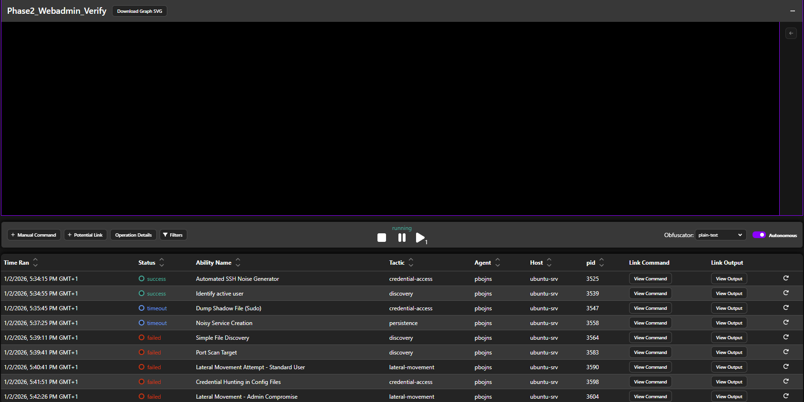
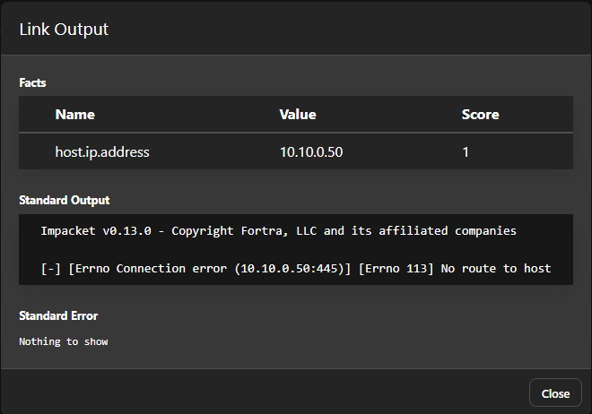

# Red Team Operator – Phase 2: Hardening Verification

This document details the re-execution of attack scenarios against the hardened infrastructure to validate the effectiveness of Blue Team defenses.

## Table of Contents
1. [Objective](#1-objective)
2. [Execution Log (Hardening Test)](#2-execution-log-hardening-test)
3. [Findings & Security Assessment](#3-findings--security-assessment)
4. [Conclusion](#4-conclusion)
    * [4.1. Technical Challenges Encountered](#41-technical-challenges-encountered)

## 1. Objective
To execute the exact same TTPs (Tactics, Techniques, and Procedures) as in Phase 1 using the `webadmin` user context and verify that the security controls implemented by the Blue Team successfully block or detect the attacks.

---

## 2. Execution Log (Hardening Test)

**Operation Name:** `Phase2_Hardening_Verify_Operation`
**Start Time:** 2026-01-02 17:06 GMT+1
**Adversary Profile:** `Phase2_Hardening_Verify` (14 Abilities)

The operation was executed against the target environment. Below is the detailed breakdown of all steps.

| Ability Name | Tactic | Status | Verification Analysis |
| :--- | :--- | :--- | :--- |
| `Automated SSH Noise Generator` | Credential Access | 🟢 **Success** | Successful generation of "ssh auth failure" logs. |
| `Identify active user` | Discovery | 🟢 **Success** | Confirmed identity: `webadmin`. |
| `Dump Shadow File (Sudo)` | Credential Access | 🟡 **TIMEOUT** | **BLOCKED.** Command hung waiting for sudo password. |
| `Noisy Service Creation` | **Persistence** | 🟡 **Partial Success** | *Observation:* Service file created in /tmp, but sudo move/start timed out. Demonstrates user-level persistence possible, but root-level blocked. |
| `Simple File Discovery` | Discovery | 🔴 **Failed** | **BLOCKED.** Permission denied. |
| `Port Scan Target` | Discovery | 🔴 **Failed** | **BLOCKED.** Network connection timed out. |
| `Lateral Mov. (Standard)` | Lateral Movement | 🔴 **Failed** | **BLOCKED.** Authentication failure. |
| `Credential Hunting` | Credential Access | 🔴 **Failed** | **BLOCKED.** File `/tmp/db_config.py` removed. |
| `Lateral Mov. (Admin)` | Lateral Movement | 🔴 **Failed** | **BLOCKED.** Error: `No route to host`. Confirms strict firewall/network segmentation rules. |
| ... | ... | ... | ... |
| `System Information Discovery`| Discovery | ⚪ **Skipped** | Chain broken. Agent not deployed on Windows. |
| `Security Software Discovery` | Discovery | ⚪ **Skipped** | Chain broken. |
| `Account Discovery` | Discovery | ⚪ **Skipped** | Chain broken. |
| `Custom Exfiltration` | **Exfiltration** | ⚪ **Skipped** | **BLOCKED.** Chain broken due to failed Lateral Movement. |

### Evidence of Remediation

**A. Operation Overview**
The operation log shows a cascade of timeouts and failures for critical offensive actions, preventing the attack from leaving the Linux host.

**B. Lateral Movement Block**
The connection to the target Windows host (10.10.0.50) failed with `No route to host`, confirming network segmentation rules are active.

---

## 3. Findings & Security Assessment

The re-test confirms that **Critical Network Defenses** and **Host-Based Hardening** are effective.

### ✅ What was Fixed (Success)
1.  **Network Segmentation / Host Firewall:**
    *   The `Lateral Movement` attempt using Impacket PsExec failed with `[Errno 113] No route to host`.
    *   **Impact:** The attack chain was successfully broken before reaching the Windows target. No Windows agent was deployed.

2.  **Credential Hygiene:**
    *   The hardcoded credentials file (`/tmp/db_config.py`) was removed.
    *   The attacker could not retrieve the plaintext admin password.

3.  **Privilege Escalation:**
    *   The `Dump Shadow File` technique timed out, proving that `sudo` now requires a password.

4.  **Persistence Mechanisms:**
    *   Root-level persistence (systemd services) blocked by sudo timeouts.
    *   User-level persistence (cron, scripts) remains viable but limited in impact.

### ⚠️ Observations
*   **Persistence:** User-level persistence (e.g., cron jobs via `crontab -e`) remains possible without root access, allowing low-level foothold maintenance. However, root-level persistence (systemd services) is blocked by sudo password requirements, preventing escalation to system-wide persistence.

---

## 4. Conclusion
The Blue Team has successfully mitigated the primary path to total domain compromise. The environment is now resilient against:
*   Lateral movement via SMB.
*   Easy privilege escalation via sudo.
*   Credential theft from config files.

**Final Status:** **SECURE** (with accepted residual user-level risk)

### 4.1. Technical Challenges Encountered

During Phase 2 testing, several hardening measures were validated:

1.  **Sudo Password Enforcement:** Commands requiring `sudo` (e.g., service creation) timed out waiting for password input, confirming privilege escalation is blocked.
2.  **Network Segmentation:** Firewall rules prevented lateral movement attempts, demonstrating effective containment.
3.  **Credential Removal:** Absence of config files prevented automated credential hunting.
4.  **Persistence Limitations:** While user-level persistence is possible (e.g., via cron), root-level mechanisms are mitigated by sudo controls.