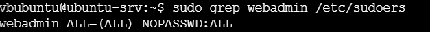
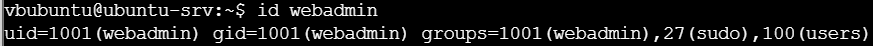
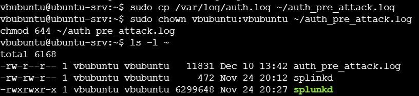
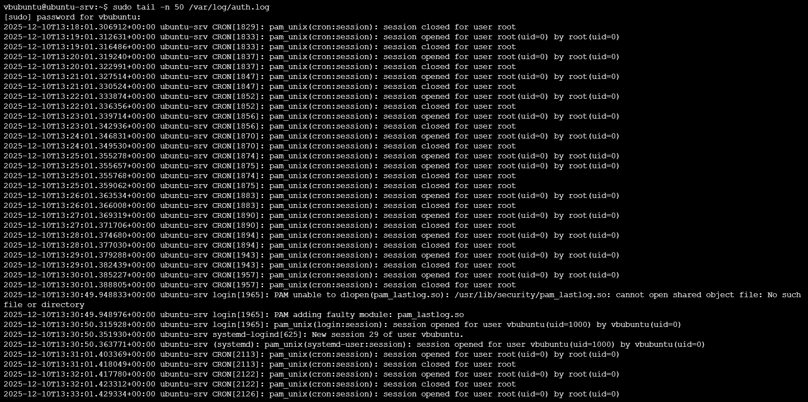
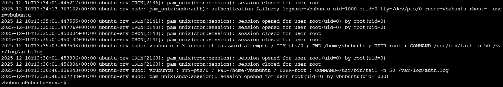
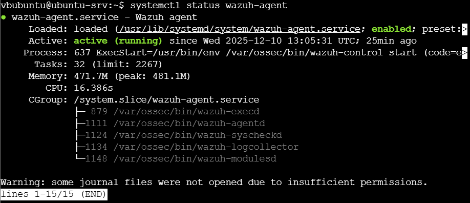

# Linux Baseline Report (Pre-Attack)
## Table of Contents
1. [Purpose & Role of the System](#1-purpose--role-of-the-system)
2. [Baseline Overview (Pre-Attack)](#2-baseline-overview-pre-attack)
  2.1. [Operating System and Identity](#21-operating-system-and-identity)
  2.2. [Users, Groups, and Privilege Model](#22-users-groups-and-privilege-model)
  2.3. [Authentication and Authorization Activity](#23-authentication-and-authorization-activity)
  2.4. [Endpoint Monitoring Status](#24-endpoint-monitoring-status)
3. [Collected Evidence](#3-collected-evidence)
4. [Baseline Behavioral Characteristics](#4-baseline-behavioral-characteristics)
5. [Key Detection Points](#5-key-detection-points)
6. [Identified Vulnerabilities and Limitations](#6-identified-vulnerabilities-and-limitations)

## 1. Purpose & Role of the System

The Linux server (`ubuntu-srv`) functions as a central infrastructure component within the Technova lab environment.  
It hosts critical services and is intended to simulate a realistic Linux server that could be targeted during lateral movement, privilege escalation, or persistence phases of an attack.

From a threat-hunting perspective, this system is especially important because Linux servers often act as:
- pivot points after initial access,
- targets for privilege escalation,
- hosts for persistence mechanisms,
- aggregation points for sensitive data or credentials.

The server is monitored by a Wazuh agent and is reachable through controlled network paths defined by the lab architecture.

---

## 2. Baseline Overview (Pre-Attack)

### 2.1 Operating System and Identity

- Operating System: Ubuntu Server (24.04 LTS)
- Hostname: `ubuntu-srv`
- Role: Internal Linux server
- Primary user: `vbubuntu`

At the time of baseline collection, the system was operational and stable, with no evidence of compromise or active attack activity.

---

### 2.2 Users, Groups, and Privilege Model

User and group enumeration identified the following relevant accounts:

- `vbubuntu`
  - Standard user account
  - Member of the `sudo` group
- `webadmin`
  - Member of the `sudo` group
  - Configured with passwordless sudo privileges

The following sudoers configuration was confirmed:

```
webadmin ALL=(ALL) NOPASSWD:ALL
```


*Figure 1: Sudoers configuration showing NOPASSWD for webadmin*

*Figure 2: User and group membership for webadmin*

This configuration represents a deliberate privilege escalation vector within the lab environment and is documented as part of the baseline to support later attack-phase analysis.
*Figure 3:*
---

### 2.3 Authentication and Authorization Activity

Baseline authentication activity was analyzed using `/var/log/auth.log`. Observed events include:

- Regular root cron sessions opening and closing
- Failed sudo authentication attempts by user `vbubuntu`
- Successful sudo session establishment following authentication
- Standard user login events via PAM
- A warning related to `pam_lastlog.so` indicating a missing or misconfigured PAM module

These events are considered normal within the context of system usage and lab setup but provide an important reference for distinguishing legitimate activity from malicious behavior during attack execution.


*Figure 3:Pre-attack auth.log snapshot*

*Figure 4: Authentication and cron activity*

*Figure 5: Sudo authentication attempts and sessions*

---

### 2.4 Endpoint Monitoring Status

The Wazuh agent was confirmed to be active and running at the time of baseline collection:

- Service: `wazuh-agent`
- State: enabled and running
- Active modules:
  - logcollector
  - syscheckd
  - execd
  - modulesd


*Figure 6: Wazuh agent service status*

This confirms that host-based telemetry from the Linux server is being forwarded to the SIEM and will be available for detection and correlation during attack scenarios.

---

## 3. Collected Evidence

The following baseline artefacts were collected from the Linux server prior to any red team activity:

- Authentication and authorization log snapshot (`auth_pre_attack_report.log`)
- Sudo configuration evidence (`/etc/sudoers`)
- User and group membership verification (`id webadmin`)
- Sudo usage audit entries from `auth.log`)
- Wazuh agent service status output


*Figure 7: Auth log snapshot*

*Figure 8: Sudoers configuration*

*Figure 9: User identity verification*

*Figure 10: Authentication activity*

*Figure 11: Sudo audit activity*

*Figure 12: Wazuh agent status*

---

## 4. Baseline Behavioral Characteristics

During the baseline observation period, the Linux server exhibited the following normal behaviors:

- Periodic root cron job execution
- Legitimate sudo usage by authorized users
- No repeated SSH login failures or brute-force patterns
- No unexpected user account creation
- No evidence of persistence mechanisms

These behaviors define the normal operational baseline for the system.

---

## 5. Key Detection Points

Based on the baseline analysis, the following areas were identified as critical detection points for future threat hunting:

- Sudo authentication failures and successes
- Passwordless sudo usage
- SSH login patterns and source attribution
- Modifications to sudoers configuration
- Creation of new privileged users
- Wazuh alerts related to authentication and privilege escalation

---

## 6. Identified Vulnerabilities and Limitations

The following weaknesses and limitations were identified during baseline analysis:

- Passwordless sudo configuration for user `webadmin`
- Dependence on PAM modules with partial misconfiguration (`pam_lastlog.so`)
- Reliance on centralized SIEM visibility for full attack detection

These findings are documented as part of the baseline and are expected to be exercised during planned attack scenarios.
