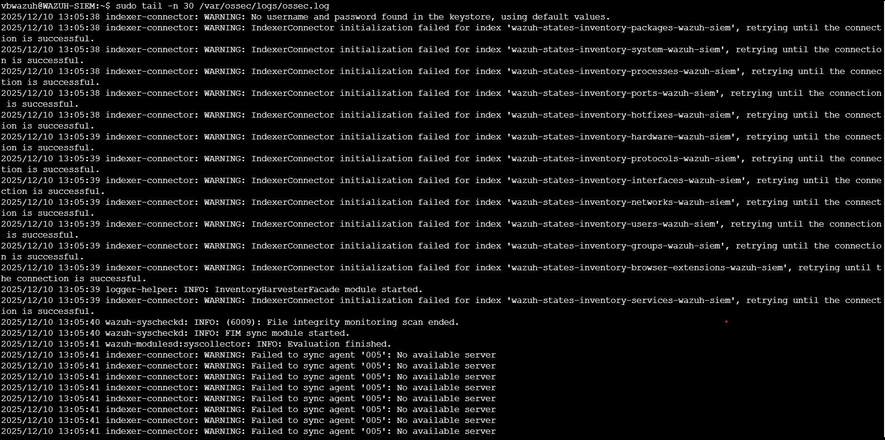
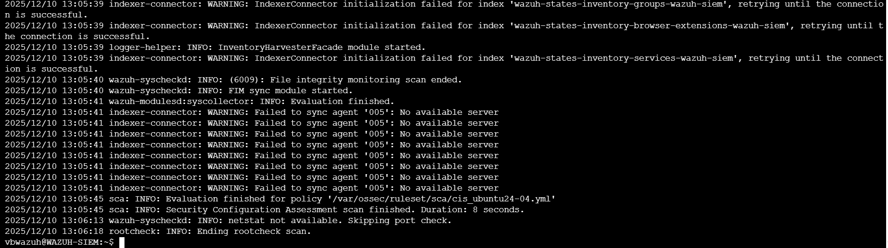
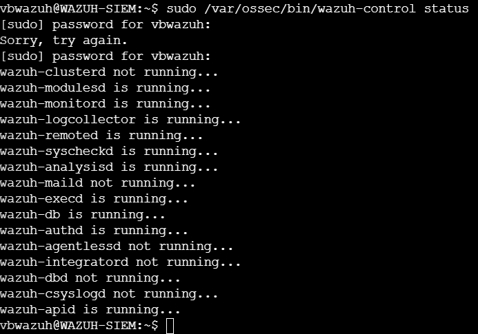
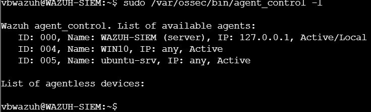

# Wazuh SIEM Baseline Report (Pre-Attack)
## Table of Contents
1. [Purpose and Scope](#1-purpose-and-scope)
2. [Service Health and Core Components](#2-service-health-and-core-components)
3. [Agent Inventory and Connectivity](#3-agent-inventory-and-connectivity)
4. [Indexer and Inventory Warnings](#4-indexer-and-inventory-warnings)
5. [File Integrity and Configuration Monitoring](#5-file-integrity-and-configuration-monitoring)
6. [Baseline Alert State](#6-baseline-alert-state)
7. [Baseline Conclusion](#7-baseline-conclusion)

## 1. Purpose and Scope

This document describes the baseline operational state of the Wazuh SIEM server prior to any attack activity. The goal is to document normal service behavior, agent connectivity,and logging conditions to support later detection analysis.

---

## 2. Service Health and Core Components

Service health was reviewed using `wazuh-control status`.
Screenshots `healthlog1.png` and `healthlog2.png` show that core services responsible for log collection, analysis, and correlation are running.

Optional services not required for a single-node deployment are inactive.

*Figure 1: Wazuh core service status – initial log output*

*Figure 2: Wazuh service status – continued output*

*Figure 3: Running Wazuh core services overview*

---

## 3. Agent Inventory and Connectivity

Agent connectivity was verified using `agent_control -l`.
The agent list screenshot (`agent_lista.png`) shows:

- Local Wazuh agent (ID 000)
- Windows workstation agent
- Linux server agent

All agents were active at baseline time.

*Figure 4: Wazuh agent inventory and connectivity*

---

## 4. Indexer and Inventory Warnings

Repeated IndexerConnector initialization warnings were observed during baseline review.
These warnings are visible in `healthlog1.png` and relate to inventory indices initializing
during startup.

Despite these warnings, inventory and monitoring modules continue to operate normally.

*Figure 5: IndexerConnector initialization warnings*

---

## 5. File Integrity and Configuration Monitoring

File Integrity Monitoring and Security Configuration Assessment activity is visible in
the SIEM logs (`alerts_pre_attack_report.log`), confirming that these modules are active.

*Figure 6: File Integrity Monitoring and SCA activity*

---

## 6. Baseline Alert State

The pre-attack alert log (`alerts_pre_attack_report.log`) does not show confirmed malicious
detections. Logged warnings relate to service initialization rather than adversary behavior.

*Figure 7: Pre-attack Wazuh log activity*

---

## 7. Baseline Conclusion

At baseline time, the Wazuh SIEM is operational, agents are connected, and detection
capabilities are active. Minor warnings observed during startup are documented and
understood, allowing future alerts to be evaluated with confidence.
