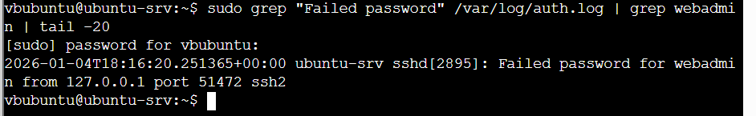
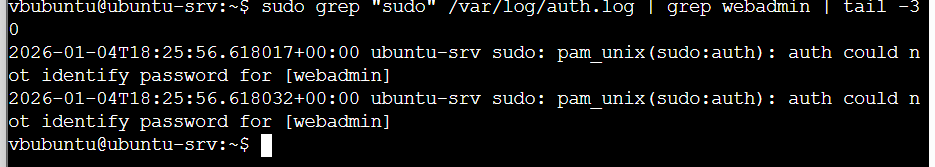

# Phase 2 – Linux Host (ubuntu-srv) Hardening Verification Report
## Table of Contents
- [Scope and Context](#scope-and-context)
- [Initial Access – SSH Authentication Attempt (FAILED)](#initial-access--ssh-authentication-attempt-failed)
- [Privilege Escalation – sudo Abuse Attempt (FAILED)](#privilege-escalation--sudo-abuse-attempt-failed)
- [Credential Access – Attempted `/etc/shadow` Access (NOT SUCCESSFUL)](#credential-access--attempted-etcsheadow-access-not-successful)
- [Attack Phases Not Reached](#attack-phases-not-reached)
- [Detection Coverage and Identified Gap](#detection-coverage-and-identified-gap)
- [Conclusion (Linux Host)](#conclusion-linux-host)

## Scope and Context

This section documents the **Phase 2 (Hardening Verification)** analysis for the Linux host `ubuntu-srv`.  
The objective was to validate whether previously exploited attack paths remain viable after security hardening, and to assess both **prevention** and **detection** capabilities.

During Phase 2, the Red Team executed attack attempts using a **CALDERA agent running locally under the `webadmin` user context**. No successful initial access or privilege escalation was expected by design.

Evidence was collected from:
- `/var/log/auth.log` on the Linux host
- Wazuh-correlated alerts
- Manual log inspection
- Screenshot-based proof provided by the analyst

---

## Initial Access – SSH Authentication Attempt (FAILED)

An SSH authentication attempt targeting the `webadmin` account was observed and logged.

The following characteristics were identified:
- Authentication method: SSH
- Target user: `webadmin`
- Source IP: `127.0.0.1` (local execution, consistent with agent-based attack)
- Result: **Failed password**

This confirms that:
- Initial access was **not achieved**
- SSH authentication controls are functioning correctly
- Failed login attempts are properly logged and visible for detection

**Evidence:**  

*Figure 1: Failed SSH authentication attempt targeting `webadmin`*

---

## Privilege Escalation – sudo Abuse Attempt (FAILED)

Following the failed SSH authentication, the attacker attempted to escalate privileges using `sudo` as the `webadmin` user.

Observed log entries indicate:
- `pam_unix(sudo:auth): auth could not identify password for [webadmin]`
- Multiple failed sudo authentication attempts
- **No successful sudo session** initiated by `webadmin`

This demonstrates that:
- `webadmin` does not possess sudo privileges
- Privilege escalation is effectively prevented
- Hardening controls (sudo password enforcement) are operating as intended

**Evidence:**  

*Figure 2: Failed sudo authentication attempts by `webadmin`*

---

## Credential Access – Attempted `/etc/shadow` Access (NOT SUCCESSFUL)

A critical attack objective was to access `/etc/shadow` to obtain credential hashes.

Log analysis confirms:
- No successful read access to `/etc/shadow` by `webadmin`
- No evidence of credential dumping
- The only `shadow`-related log entry corresponds to an analyst’s verification command, not attacker activity

This confirms that:
- Sensitive credential files remain protected
- Credential access techniques were unsuccessful

**Evidence:**  

*Figure 3: Attempted access to `/etc/shadow` by `webadmin`*

---

## Attack Phases Not Reached

Due to the failure of both Initial Access and Privilege Escalation, the attack chain did **not progress** to subsequent phases, including:

- Discovery (e.g., `find`, filesystem enumeration)
- Lateral Movement (e.g., PsExec over SMB/RPC)
- Data Exfiltration (e.g., `curl` to external C2 on port 8888)

The absence of artifacts related to these phases is an **expected and correct outcome** for Phase 2.

---

## Detection Coverage and Identified Gap

### What Was Successfully Detected
- Failed SSH authentication attempts
- Failed sudo authentication attempts
- Relevant authentication-related events correctly correlated by Wazuh

### Detection Gap Identified
Execution of attack tooling (e.g., `python3 psexec.py`, `nc`) did **not** generate observable telemetry in Wazuh.

**Root Cause:**
- The Linux Wazuh agent is not configured to collect **process execution telemetry** (e.g., auditd / `execve` logging).

This represents a **Detection Gap**, not a failure of existing detection logic.

---

## Conclusion (Linux Host)

The Phase 2 hardening validation for `ubuntu-srv` confirms that the system is resilient against the tested attack paths:

- Initial Access:  Blocked  
- Privilege Escalation:  Blocked  
- Credential Access:  Blocked  
- Lateral Movement:  Not reached  
- Data Exfiltration: Not reached  

Security controls successfully prevented escalation and progression of the attack. Detection mechanisms effectively captured authentication-related abuse, while process-level visibility remains an identified improvement area for future enhancement.

Overall, the Linux host meets the security objectives defined for Phase 2.
