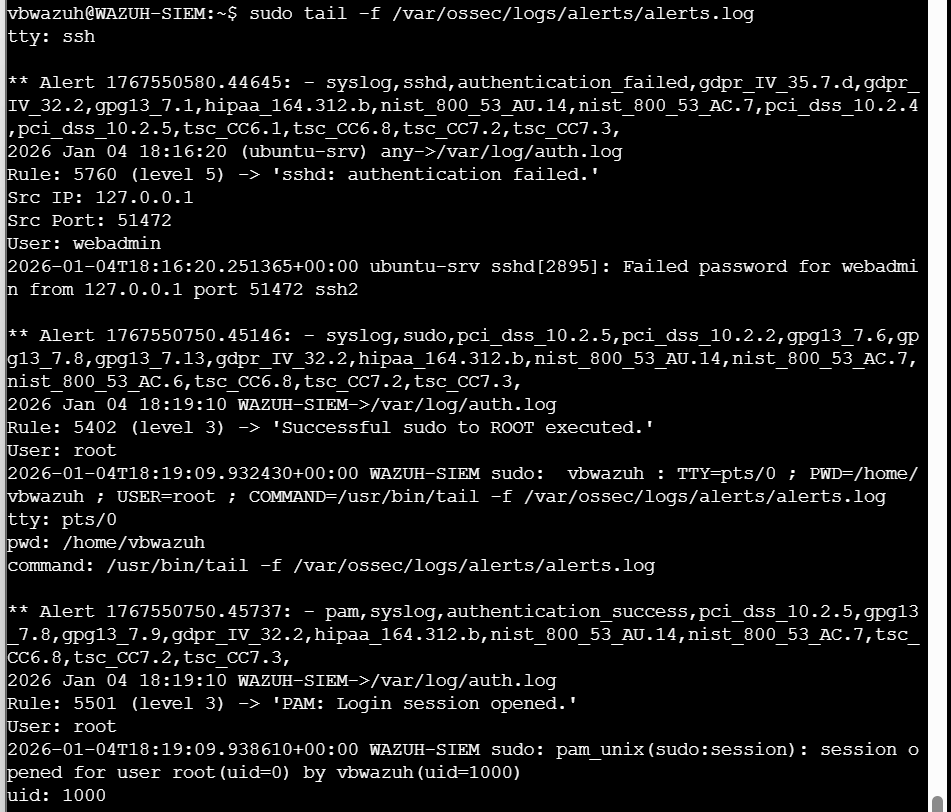
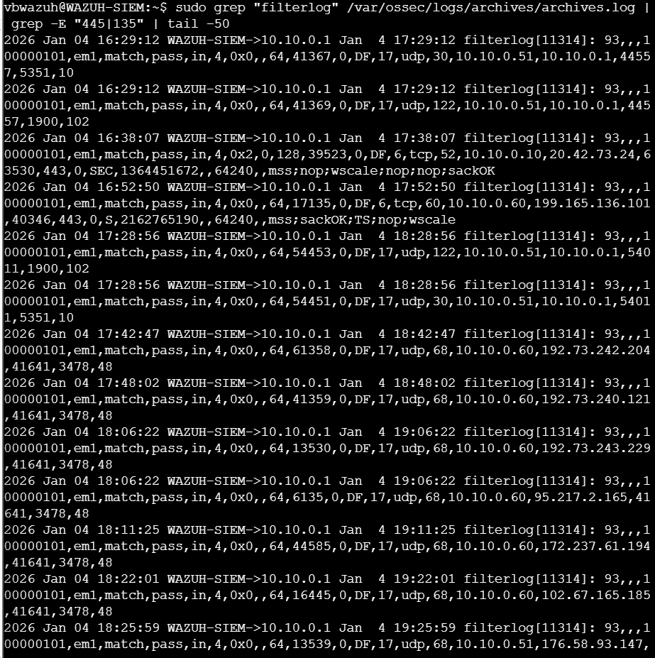

# Phase 2 – Wazuh SIEM Analysis (Hardening Verification)
## Table of Contents
1. [Scope and Objective](#scope-and-objective)
2. [Authentication-Based Attack Detection (SUCCESSFUL)](#authentication-based-attack-detection-successful)
  2.1. [SSH Authentication Failure](#ssh-authentication-failure)
3. [Privilege Escalation Detection (SUCCESSFUL, WITH CONTEXT)](#privilege-escalation-detection-successful-with-context)
4. [Lateral Movement Detection – Network Perspective (BLOCKED)](#lateral-movement-detection--network-perspective-blocked)
5. [Correlation with Red Team Execution](#correlation-with-red-team-execution)
6. [Detection Gap Identified – Process Execution Visibility](#detection-gap-identified--process-execution-visibility)
7. [Conclusion (Wazuh SIEM)](#conclusion-wazuh-siem)

## 1. Scope and Objective

This section documents the **Phase 2 (Hardening Verification)** analysis from the **Wazuh SIEM perspective**.  
The goal was to validate whether Wazuh successfully detects and correlates attack attempts executed during Phase 2, and to assess visibility into both **authentication-based attacks** and **lateral movement attempts** after infrastructure hardening.

The analysis focuses on:
- `/var/ossec/logs/alerts/alerts.log`
- `/var/ossec/logs/archives/archives.log`
- pfSense firewall telemetry ingested via `filterlog`
- Screenshot-based evidence provided during investigation

---

## 2. Authentication-Based Attack Detection (SUCCESSFUL)

### 2.1. SSH Authentication Failure

Wazuh successfully detected a failed SSH authentication attempt targeting the `webadmin` user.

Observed alert characteristics:
- Rule ID: **5760**
- Alert level: **5**
- Attack type: SSH authentication failure
- Target user: `webadmin`
- Source IP: `127.0.0.1`
- Log source: `/var/log/auth.log`

This event corresponds to a **failed credential access attempt**, consistent with Phase 2 testing objectives.  
The detection confirms that Wazuh correctly ingests and correlates SSH authentication failures on Linux endpoints.

**Evidence:**  

*Figure 1: Wazuh alerts – authentication and sudo activity*

---

## 3. Privilege Escalation Detection (SUCCESSFUL, WITH CONTEXT)

Wazuh generated alerts related to successful `sudo` execution to root.

However, log inspection confirms that:
- The detected sudo events correspond to **analyst activity**
- Commands executed were related to log inspection (`tail -f`)
- No sudo escalation was successfully performed by the attacker (`webadmin`)

Therefore:
- These alerts are **not malicious**
- They demonstrate correct sudo monitoring and compliance logging
- They were excluded from attack attribution

This distinction highlights proper analyst-driven validation and correct alert interpretation.

**Evidence:**  

*Figure 2: Wazuh alerts – authentication and sudo activity*

---

## 4. Lateral Movement Detection – Network Perspective (BLOCKED)

To identify potential lateral movement, pfSense `filterlog` telemetry was analyzed for SMB/RPC-related traffic.

### Expected Indicators for Lateral Movement
- Protocol: **TCP**
- Destination ports: **445 (SMB)** or **135 (RPC)**
- Destination host: **10.10.0.50 (Windows workstation)**

### Observed Network Telemetry
Analysis of `filterlog` entries shows:
- Predominantly **UDP-based traffic**
- Destination ports such as `68`, `1900`, `5351`
- Outbound HTTPS traffic on port `443`
- **No TCP connections to port 445 or 135**
- **No traffic directed to 10.10.0.50**

Numeric matches for values such as `44553`, `13530`, or `16445` were identified as **ephemeral source ports**, not destination service ports.

This confirms that:
- No SMB or RPC session was established
- Lateral movement did **not** occur at the network level
- Firewall segmentation successfully prevented progression of the attack

**Evidence:**  

*Figure 3: pfSense filterlog – no lateral movement detected*

---

## 5. Correlation with Red Team Execution

CALDERA execution logs confirmed that:
- PsExec was attempted
- The attempt failed with `No route to host (10.10.0.50:445)`

This aligns fully with Wazuh observations:
- No SMB/RPC traffic detected
- No Windows-side artifacts
- No lateral movement telemetry available

The absence of Wazuh alerts for lateral movement is therefore **expected and correct**.

---

## 6. Detection Gap Identified – Process Execution Visibility

While Wazuh successfully detected:
- SSH authentication failures
- sudo-related authentication events

It did **not** detect:
- Execution of attack tooling such as `python3 psexec.py` or `nc`

**Root Cause:**
- The Linux Wazuh agent is not configured to collect **process execution telemetry** (e.g., auditd / execve events).

As a result:
- Failed attack processes that do not trigger authentication, privilege escalation, or network events are not visible at the SIEM level.

This is classified as a **Detection Gap**, not a failure of existing detection logic.

---

## 7. Conclusion (Wazuh SIEM)

Wazuh SIEM performed as expected during Phase 2 hardening validation:

- Credential abuse attempts were detected and correlated
- Analyst activity was correctly logged and distinguishable
- Lateral movement was effectively blocked and validated through network telemetry
- No false positives related to PsExec or SMB activity were generated

The identified limitation relates solely to **process execution visibility on Linux endpoints**, representing a clear and actionable improvement opportunity rather than a security failure.

Overall, Wazuh provided accurate and reliable detection coverage aligned with the objectives of Phase 2.
